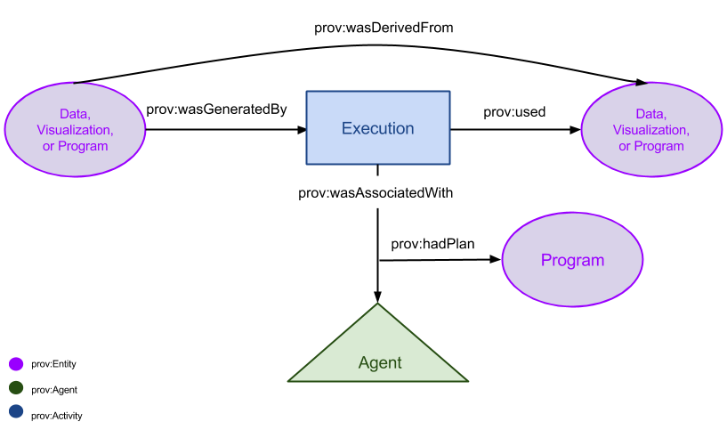

# PROV Ontology and Model

## Intro
The DataONE PROV data model will be used to describe the relationships between:
* Derived resources and the original resources used to create them
* Data resources and the activities used to create them
* Programs (e.g. software, scripts) that were implemented to create a data resource

## Diagrams
### Diagram of the PROV Model

### Diagram of a PROV Model Example

This data model uses the [W3C PROV Ontology and Data Model](http://www.w3.org/TR/prov-o/) to define classes of objects and the relationships between them. 

## PROV-O Classes
##### [Activity](http://www.w3.org/TR/2013/REC-prov-o-20130430/#Activity) 
PROV-O definition: An activity is something that occurs over a period of time and acts upon or with entities; it may include consuming, processing, transforming, modifying, relocating, using, or generating entities.
##### [Entity](http://www.w3.org/TR/2013/REC-prov-o-20130430/#Entity)
##### [Plan](http://www.w3.org/TR/2013/REC-prov-o-20130430/#Plan) 
PROV-O definition: A plan is an entity that represents a set of actions or steps intended by one or more agents to achieve some goals.
##### [Agent](http://www.w3.org/TR/2013/REC-prov-o-20130430/#Agent) 
PROV-O definition: An agent is something that bears some form of responsibility for an activity taking place, for the existence of an entity, or for another agent's activity.
	* DataONE may not capture information about agents during the first phase of the semantics and provenance work, but it is one of the major classes of the PROV-O ontology.
##### [Association](http://www.w3.org/TR/2013/REC-prov-o-20130430/#Association)
Qualifies: prov:wasAssociatedWith
Prov-O definition: An Execution association is an assignment of responsibility to an agent for an activity, indicating that the agent had a role in the activity. It further allows for a plan to be specified, which is the plan intended by the agent to achieve some goals in the context of this activity.
	

		
## Model Specification

### Classes

 PROV-O Superclass | DataONE Subclass |
-------------------|------------------|
 Entity 	   | Data, Visualization, Program	
 Activity          | Execution

### Data class 
##### has superclass [prov:Entity](http://www.w3.org/TR/2013/REC-prov-o-20130430/#Entity)
A Data object represents a basic unit of information consumed or generated by an Execution.
e.g. Data table
	
### Visualization class 
##### has superclass [prov:Entity](http://www.w3.org/TR/2013/REC-prov-o-20130430/#Entity)
A Visualization object is a visual representation of information and is generated by Executions.
e.g. figure, map

### Program class
##### has superclass [prov:Entity](http://www.w3.org/TR/2013/REC-prov-o-20130430/#Entity) and [prov:Plan](http://www.w3.org/TR/2013/REC-prov-o-20130430/#Plan)
A Program object represents a unit of code or instructions that can be implemented (Execution) to consume and/or generate Data and Visualization objects. Becuase Program is a subclass of Entity, it can also be generated by an Execution.
e.g. script, software
From PROV-O
> Since plans may evolve over time, it may become necessary to track their provenance, so plans themselves are entities. Representing the plan explicitly in the provenance can be useful for various tasks: for example, to validate the execution as represented in the provenance record, to manage expectation failures, or to provide explanations.

### Execution class
##### has superclass [prov:Activity]()
An Execution object represents a single implementation of a Program
e.g. script run

### Properties

### [prov:hadPlan](http://www.w3.org/ns/prov#hadPlan)
##### has domain: prov:Association (prov:wasAssociatedWith)
##### has range: Program
hadPlan is a property of an Association (e.g. prov:wasAssociatedWith) that points to the prov:Plan implemented by a prov:Activity.

### [prov:used] (http://www.w3.org/ns/prov#used)
##### has domain: Execution
##### has range: Data, Program
Usage is the beginning of utilizing an entity by an activity. Before usage, the activity had not begun to utilize this entity and could not have been affected by the entity.

### [prov:wasAssociatedWith] (http://www.w3.org/ns/prov#wasAssociatedWith)
##### has domain: Execution
##### has range: prov:Agent
prov:wasAssociatedWith is an assignment of responsibility to a prov:agent for an Execution, indicating that the agent had a role in the Execution. It further allows for a plan to be specified, which is the plan intended by the agent to achieve some goals in the context of this activity. 
An association must have at least one property: an id, an agent, a plan, or attributes. This DataONE PROV data model will include plans but will not include prov:Agents at this time.

### [prov:wasDerivedFrom] (http://www.w3.org/ns/prov#wasDerivedFrom)
##### has domain: Data, Visualization, Program
##### has range: Data, Program
A derivation is a transformation of an entity into another, an update of an entity resulting in a new one, or the construction of a new entity based on a pre-existing entity.

### [prov:wasGeneratedBy] (http://www.w3.org/ns/prov#wasGeneratedBy)
##### has domain: Data, Visualization, Program
##### has range: Execution
Generation is the completion of production of a new entity by an activity. This entity did not exist before generation and becomes available for usage after this generation.

### [prov:wasInformedBy] (http://www.w3.org/ns/prov#wasInformedBy)
##### has domain: Execution
##### has range: Execution
Communication is the exchange of an entity by two activities, one activity using the entity generated by the other.

