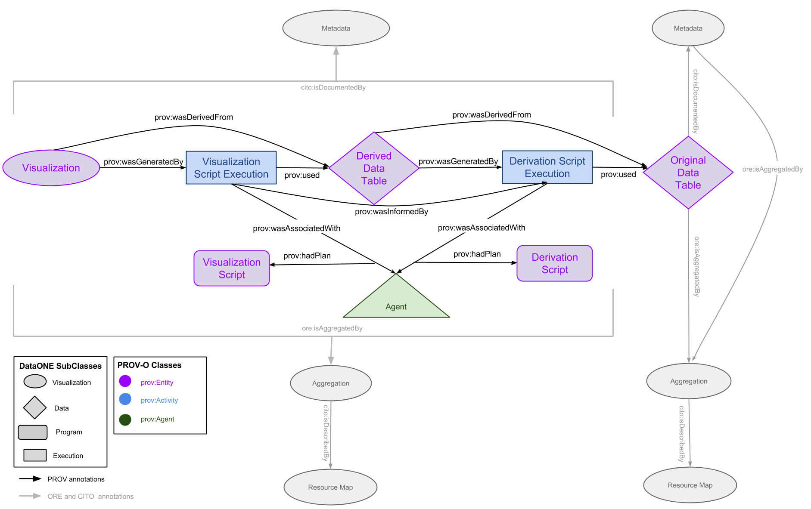

PROV Ontology and Model
=======================

Diagram of the PROV Model, Generally
------------------------------------

Diagram of a PROV Model Example
------------------------------------

Definitions
-----------
The DataONE PROV data model will be used to describe the relationships between:
* Derived resources and the original resources used to create them
* Data resources and the activities used to create them
* Programs and the actors that use that program to create a data resource

This data model borrows heavily from the [W3C PROV Ontology and Data Model](http://www.w3.org/TR/prov-o/) to define classes of objects and the relationships between them. 

### Three classes of objects are used in PROV-O and the DataONE PROV model:
* [Entity](http://www.w3.org/TR/2013/REC-prov-o-20130430/#Entity)
	+ PROV-O definition: An entity is a physical, digital, conceptual, or other kind of thing with some fixed aspects; entities may be real or imaginary.
	+ DataONE: An entity is a [DataONE object](http://mule1.dataone.org/ArchitectureDocs-current/overview.html), such as a data table, or scientific metadata.
* [Activity](http://www.w3.org/TR/2013/REC-prov-o-20130430/#Activity)
	+ PROV-O definition: An activity is something that occurs over a period of time and acts upon or with entities; it may include consuming, processing, transforming, modifying, relocating, using, or generating entities.
	+ DataONE: An activity represents a program execution and is stored as data about that execution.
* [Agent](http://www.w3.org/TR/2013/REC-prov-o-20130430/#Agent)
	+ PROV-O definition: An agent is something that bears some form of responsibility for an activity taking place, for the existence of an entity, or for another agent's activity.
	+ DataONE: An agent is the program itself, such as a script file.
	
### The terms from the PROV ontology that will be used:
   * [wasGeneratedBy] (http://www.w3.org/ns/prov#wasGeneratedBy) : Generation is the completion of production of a new entity by an activity. This entity did not exist before generation and becomes available for usage after this generation.
   * [wasDerivedFrom] (http://www.w3.org/ns/prov#wasDerivedFrom) : A derivation is a transformation of an entity into another, an update of an entity resulting in a new one, or the construction of a new entity based on a pre-existing entity.
   * [used] (http://www.w3.org/ns/prov#used) : Usage is the beginning of utilizing an entity by an activity. Before usage, the activity had not begun to utilize this entity and could not have been affected by the entity.
   * [wasInformedBy] (http://www.w3.org/ns/prov#wasInformedBy) : Communication is the exchange of an entity by two activities, one activity using the entity generated by the other.
   * [wasAttributedTo] (http://www.w3.org/ns/prov#wasAttributedTo) : Attribution is the ascribing of an entity to an agent.