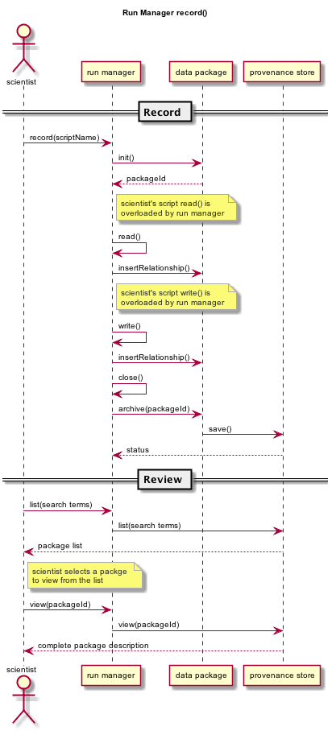

DataONE Run Manager and API for Capturing Provenance in Script Executions
=========================================================================

Overview
--------

Scientists need a way to easily capture provenance for their data processing and analysis and have 
an automated way to upload provenance and derived data products from their analysis to a data repository such as those in the DataONE network. 

Several use cases for storing provenance have been outlined: UseCases_

.. _UseCases: https://github.com/DataONEorg/sem-prov-design/tree/master/docs/use-cases/provenance

This document summarizes the session “Provenance Capture in R” at Open Science Codefest, 
a Community Dynamics working group meeting, and other DataONE Semantics and Provenance Working Group discussions.

A way to capture provenance as conveniently for the scientist as possible is through a run manager. 
A run manager can capture provenance while a script is running, requiring very little extra code from the scientist. 
The run manager is aware of the provenance relationships and how to recognize those relationships based on the 
actions of the script. 

To use the run manager, a user needs to start recording, such as with a function *record()*
All information recorded by the run manager can then be viewed after the script execution has ended. This allows 
the scientist to re-record the script execution and once satisfied, publish to a DataONE-enabled repository via a
method call such as *publish()*.                                                                                                                                                                                                                                                                                                                                                                                                                                                                                                                                                                                                                                                                                                                                                                                                                                                                                                             

Run Manager API
---------------

*record(filePath)*

The record method executes the specified script and records the files read and created by the script. 
In-memory objects need to be considered also. It's possible that a script never writes to disk, but just
creates an in-memory final product. This may be specified in a configuration API
Provenance relationships for the script execution are automatically determined based on the run 
manager’s built-in knowledge of the provenance ontology. 

The record method creates and returns a DataPackage that contains the provenance relationships and derived data 
objects for a single script invocation. 

Since record() returns the DataPackage, the DataPackage can be viewed and manipulated before publishing. For example, 
members of the package can be removed, new objects (such as scientific metadata) can be added, and relationships can be manually inserted via *insertRelationship()*.
Note: *insertRelationShip* is a method in DataPackage.R.
The *record()* method should return the runId of the recorded run, and then the Run class should allow the user to get any DataPackages produced, etc.

The following diagram shows a single invocation of record() and how provenance would be captured for reading a CSV file:

    
*publish(DataPackage, Client)*

The publish function will reserve DataONE identifiers for each member of the DataPackage using the 
DataONE REST API. The DataPackage that was initially created by *record()* will be recreated using these identifiers.

If the script execution used an existing DataONE object as an input (determined 
by looking for functions such as *getD1Object()* in R), then this object will not 
be aggregated in this DataPackage, but will still be referred to in provenance relationships, such as prov:used.

The complete DataPackage will be uploaded to a repository using the specified D1Client.
A configuration API will allow the scientist to set default properties like AccessPolicy, ReplicationPolicy, etc.

It may be useful for the publish() function to include a parameter for the ID format, such as a preferred DOI prefix.
Identifier creation will be configurable so the scientist have control over the format of the identifiers that they create.

*view(DataPackageRunId)*

This function can be called after *record()* and before *publish()* as an easy way to preview the DataPackage and 
run manager results before publishing. Warnings and other messages can be displayed, such as “Warning: There is no 
scientific metadata in this data package.” The output of view() can start out as simple lines of text, but it may 
be worth considering a GUI for viewing the DataPackage, such as with Shiny in R.

*view()* will output:

A list of members of the DataPackage
A list of the relationships between members in the DataPackage
A readable version of the run manager results, such as script execution time, run environment, etc.

Example of the view() output:

::

   view(dataPkg)

   Data Package Members:

   figure.1.1  was generated by  execution.1.1
   execution.1.1 used data.1.1
   execution.1.1 used script.1.1
   data.1.1 is documented by metadata.1.1
   figure.1.1 is documented by metadata.1.1
   script.1.1 is documented by metadata.1.1
   
   Execution.1.1:

   run start time: Mon Sep 8 13:01
   run end time: Mon Sep 8 13:02
   R version: 3.0.1
   Operating system: Ubuntu 12.04
   Host name: laurenshome

How Provenance Is Captured by the Run Manager
---------------------------------------------

The run manager overloads functions that read input and write output in 
order to capture the objects that are used and 
generated by the script execution. For example, when a script reads in a .csv file, the 
run manager can infer the triple “script execution -> prov:used -> .csv file”. 

Provenance relationships to be captured
---------------------------------------
- wasGeneratedBy
  
  When an output is created by the script execution, the run manager can infer that the ouput “prov:wasGeneratedBy” the script execution.
  
  Detection: The run manager will overload R functions such as write.csv and createD1Object() to capture the data file the script execution generates.
- used
  
  When the script execution reads input data, it can infer that the script execution “prov:used” the input data.
  
  Detection: The run manager will overload R functions such as getD1Object() and read.csv().
- wasDerivedFrom
  
  After the “prov:wasGeneratedBy”  and “prov:used” relationships are created, we can infer that a data object 
  generated by this script execution “prov:wasDerivedFrom” the inputs the script “prov:used”
- wasInformedBy
  
  When the script initially executed by record() invokes another script run, the run manager can infer 
  that the initial execution  “prov:wasInformedBy” the other script execution it triggered.
  
  Detection: The run manager will overload the R function source().

Adding Scientific Metadata to the Data Package after Recording a Script Execution
---------------------------------------------------------------------------------

.. _package: https://github.com/ropensci/EML

Since a script may not generate metadata or read it in as a data input, the scientist may have to 
explicitly add a scientific metadata file to the DataPackage. This can be done using existing 
metadata-creation tools, such as Morpho or the R EML package_ from rOpenSci.

The run manager has the potential to create minimal EML to include in the DataPackage in 
case the scientist does not add any before publishing. We will need to research automated metadata extraction tools.

Implementation
--------------
The run manager will be implemented in two phases:

Phase I

- Record
  
  Overload D1.get() functions to capture provenance
  
  Overload D1.create() functions to capture provenance
  
  Overload D1.update() functions to capture provenance
  
  Capture of script execution details - run time, run environment, etc.
  
  Wrap this all in a single API call, record()
  
- View

  Create a DataPackage and run manager view() function to output a textual representation of the DataPackage and run manager results

Phase II

- Record

  Overload read.csv() functions to capture provenance
  
  Overload write.csv() functions to capture provenance
  
- View

  Possibly - Expand the view() function to output a GUI representation of the DataPackage and run manager results

Run Manager Storage
-------------------

The record() method detailed above is only useful for tracking a single execution of a script. To track the result of multiple script runs, using DataPackage as the  storage mechanism may be inefficient, as each DataPackage has to be inspected separately when listing all runs that have been recorded.

A scientist may have many script executions that are good candidates for a final product to publish. If the run manager can store multiple runs, the scientist has an interface to review past script executions, similar to Kepler. The run manager would essentially store a list of DataPackages created via record() (or a different storage mechanism altogether) and an archive of the input and output files used and generated by the script execution.

The run manager could allow the scientist to:

- Review each DataPackage and script execution result, such as view()
- Review the data files used and generated in each script execution

Concerns
--------
- Do we need an abstraction layer, i.e. similiar to the Data Access Object pattern, inbetween record() and the 
  storage routines, e.g. DataPackage.insertRelationShip(). For example a DAO pattern might be called from record()? 
  Example methods in this API might be storeProv(subject, predicate, object), getProv(<search terms>),
  that are hide the storeage implimentation from record(), publish(), view().
- How will we automatically capture metadata about input data files, if needed? (Can anything be learned 
  from the AutoMeta Open Science Codefest session ?)
- How can we support publishing to a repository other than DataONE?
- Anything we missed?
