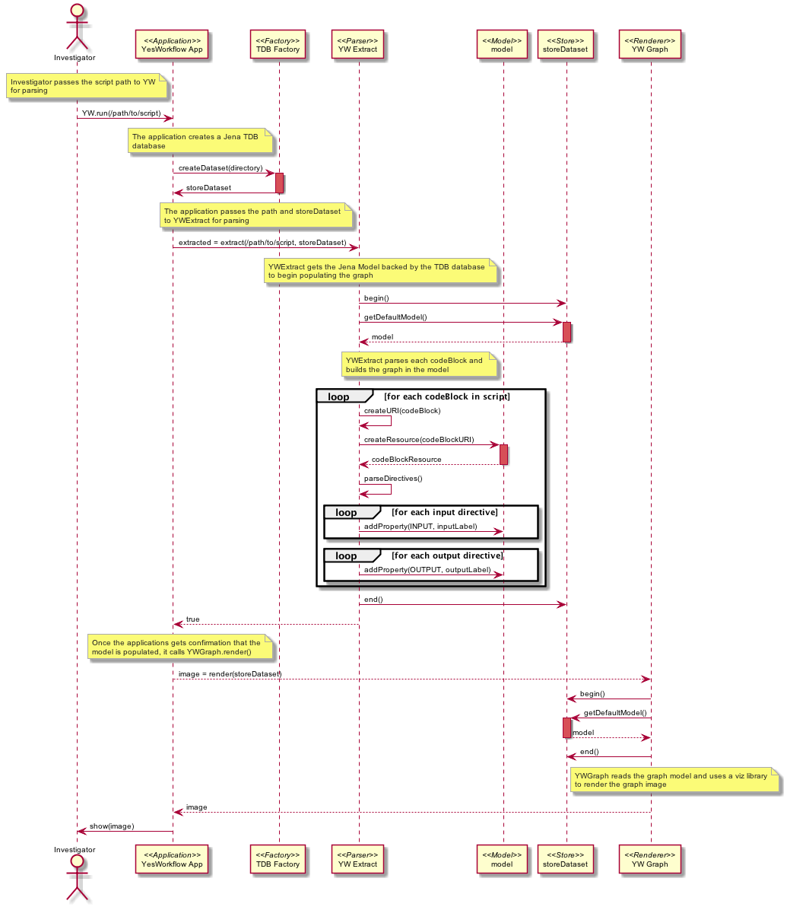

YesWorkflow draft architecture 
==============================
The following sequence diagram describes a draft architecture for the prototype YesWrkflow application.  The components would include:

- The main YesWorkflow Java application
- The Apache Jena TDB database for storing and retrieving a graph model
- The YWExtract class that parses a script using a comment grammar
- The YWGraph class that reads the model and generates an image of the workflow

.. 
    @startuml ./images/yw-sequence.png 
        !include ../../use-cases/plantuml.conf
        Actor Investigator 
        participant "YesWorkflow App" as yw_app <<Application>> 
        participant "TDB Factory" as tdb_factory <<Factory>> 
        participant "YW Extract" as yw_extract <<Parser>>
        participant "model" as model <<Model>> 
        participant "storeDataset" as tdb <<Store>> 
        participant "YW Graph" as yw_graph <<Renderer>> 
        participant "YW Export" as yw_graph <<Serializer>>
        note left of yw_app
            Investigator passes the script path to YW
            for parsing
        end note 
        Investigator -> yw_app: YW.run(/path/to/script)
        note left of tdb_factory
            The application creates a Jena TDB 
            database
        end note
            yw_app -> tdb_factory: createDataset(directory)
        activate tdb_factory #D74F57
            tdb_factory -> yw_app: storeDataset
        deactivate tdb_factory
        note left of yw_extract
            The application passes the path and storeDataset
            to YWExtract for parsing
        end note
        yw_app -> yw_extract: extracted = extract(/path/to/script, model)
        note left of model
            YWExtract gets the Jena Model backed by the TDB database
            to begin populating the graph
        end note
        yw_extract -> tdb: begin()
        yw_extract -> tdb: getDefaultModel()
        activate tdb #D74F57
            tdb --> yw_extract: model
        deactivate tdb
        note left of model
            YWExtract parses each codeBlock and 
            builds the graph in the model
        end note
        loop for each codeBlock in script
            yw_extract -> yw_extract: createURI(codeBlock)
            yw_extract -> model: createResource(codeBlockURI)
            activate model #D74F57
                model --> yw_extract: codeBlockResource
            deactivate model
            yw_extract -> yw_extract: parseDirectives()
            loop for each input directive
                yw_extract -> model: addProperty(INPUT, inputLabel)
            end
            loop for each output directive
                yw_extract -> model: addProperty(OUTPUT, inputLabel)
            end
        end
        yw_extract -> tdb: end()
        yw_extract --> yw_app: true
        note left of tdb_factory
            Once the applications gets confirmation that the
            model is populated, it calls YWGraph.render()
        end note
        yw_app --> yw_graph: image = render(storeDataset)
        yw_graph -> tdb: begin()
        yw_graph -> tdb: getDefaultModel()
        activate tdb #D74F57
            tdb --> yw_graph: model
        deactivate tdb
        yw_graph -> tdb: end()
        note right of tdb
            YWGraph reads the graph model and uses a viz library
            to render the graph image
        end note
        yw_graph --> yw_app: image
        yw_app -> Investigator: show(image)        
    @enduml
   

