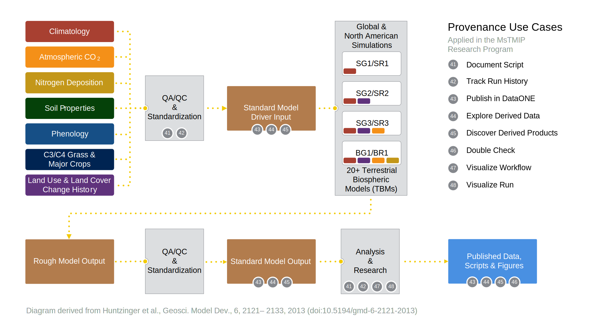

MsTMIP and DataONE: A Science Workflow Scenario
===============================================

Improving scientific model sharing and communication through provenance
-----------------------------------------------------------------------

The North American Carbon Program's (NACP) Multiscale Terrestrial Model Intercomparison Project (MsTMIP) is a formal model intercomparison and evaluation effort focused on improving the diagnosis and attribution of carbon exchange at regional and global scales [1].  The MsTMIP effort is being used as a concrete scientific research scenario to evaluate tools being developed within the `DataONE`_ program to track and share scientific workflows and the products that are derived from them or other scientific efforts.

[Add more here. This paragraph will describe the overall steps in the MsTMIP workflow where we are applying the provenance use cases, starting from model driver data ingestion to the published figures, etc. Reference the overview image ...]

   
   Figure 1. An overview of the MsTMIP scientific workflow, labeled with the DataONE use cases being developed to test new provenance tracking software tools.

Step 1: Loading Driver Data
---------------------------

As researchers who prepare model driver data for MsTMIP using Matlab, we want to keep track of our data input files, data output files and scripts so we can review and compare our runs using different Carbon3/Carbon4 (C3C4) calculation algorithms. The Matlab ingestion script takes 3 data sets as inputs:

- North American 1/4-degree resolution land cover map
- monthly mean surface air temperature between 2000 and 2010
- monthly mean precipitation between 2000 and 2010

It will then calculate relative fractions of C3 and C4 grass in each 1/4-degree grid cell, and output the result as a ________.

Expected Inputs and Outputs
~~~~~~~~~~~~~~~~~~~~~~~~~~~

- Input script is MSTMIP-INPUT-SCRIPT-NAME (`C3_C4_map_present.m`_)

.. _`C3_C4_map_present.m`: https://github.com/DataONEorg/sem-prov-design/blob/master/docs/use-cases/provenance/example-files/mstmip/Driver/C3C4/C3_C4_map_present.m)

- `Input datasets`_ are MSTMIP-INPUT-DATASET-LIST
    - North American 1/4-degree resolution land cover map
    - monthly mean surface air temperature between 2000 and 2010
    - monthly mean precipitation between 2000 and 2010. 

.. _`Input datasets`: https://github.com/DataONEorg/sem-prov-design/tree/master/docs/use-cases/provenance/example-files/mstmip/Driver/C3C4/inputs)

- Input derived datasets are MSTMIP-INPUT-DERIVED-DATASET-LIST (Not applicable in this case)
    
- Input execution environment attributes are MSTMIP-INPUT-EXECUTION-ENVIRONMENT-ATTRIBUTE-LIST
    - Not applicable in this case

- Output recorded script execution is MSTMIP-OUTPUT-RECORDED-SCRIPT-EXECUTION-LIST
    - The list provided by DataONE

- Output provenance relationship list is MSTMIP-PROVENANCE-RELATIONSHIP-LIST 
    - The list provided by DataONE

- Output provenance relationship visualization is MSTMIP-PROVENANCE-RELATIONSHIP-VISUALIZATION
    - The visualization provided by DataONE

- Usability: Scientist can filter MSTMIP-OUTPUT-RECORDED-SCRIPT-EXECUTION-LIST 
    - by execution date, time, input dataset, input derived dataset, output dataset, ...

- Usability: scientist can view relationships between items in MSTMIP-PROVENANCE-RELATIONSHIP-LIST

- Usability: scientist can select desired MsTMIP data products and send them to DataONE

Step 2: Instrumenting and running terrestrial biospheric models
---------------------------------------------------------------

Bacon pork belly tail pastrami. Biltong prosciutto venison bresaola beef spare ribs. Meatloaf hamburger capicola pancetta. Shoulder sirloin doner boudin. Boudin shankle hamburger pork, sirloin tongue pork chop jowl salami chicken ham. Doner rump tail leberkas cow prosciutto. Pork loin short loin porchetta boudin ribeye cow strip steak doner turducken pork belly pork pork chop capicola.

Step 3: Instrumenting and running global simulations
----------------------------------------------------

Short ribs boudin jowl beef kevin biltong salami turkey ball tip pork leberkas kielbasa ground round ham turducken. Jerky landjaeger kielbasa rump flank ham ribeye pork pork chop fatback venison meatball corned beef. Meatball kielbasa boudin sirloin turkey. Ball tip meatloaf corned beef meatball pastrami jerky sausage venison. Shank kielbasa leberkas shankle sirloin.

Step 4: QA/QC and standardization of model output
-------------------------------------------------

Kielbasa tri-tip brisket prosciutto meatloaf frankfurter filet mignon t-bone capicola shankle leberkas pork chop jerky pork pork loin. Short loin kielbasa tongue sirloin pastrami leberkas doner tenderloin swine t-bone cow meatball turkey beef. Shoulder strip steak pork belly shank corned beef. Pork belly flank leberkas, ground round meatloaf pork chop bresaola ham jowl tri-tip salami corned beef sirloin. Turducken chuck pig short ribs short loin kevin pancetta ground round flank meatloaf jerky ribeye jowl. Pancetta kevin venison meatball ball tip pig salami brisket pork shankle fatback leberkas filet mignon tail beef ribs.

Step 5: Analysis and model run intercomparisons
-----------------------------------------------

Brisket leberkas porchetta, cow beef tenderloin doner bacon tail ribeye short ribs flank. Corned beef meatloaf ham turducken bacon frankfurter beef. Pork chop ball tip short loin beef. Andouille biltong cow bresaola capicola. Pastrami shankle bacon rump.

References
----------

[1] Huntzinger, et al.: The North American Carbon Program Multi-Scale Synthesis and Terrestrial Model Intercomparison Project – Part 1: Overview and experimental design, Geosci. Model Dev., 6, 2121-2133, doi:10.5194/gmd-6-2121-2013, 2013. `http://dx.doi.org/10.5194/gmd-6-2121-2013`_

.. _`http://dx.doi.org/10.5194/gmd-6-2121-2013`: http://dx.doi.org/10.5194/gmd-6-2121-2013

.. _`DataONE`: http://dataone.org