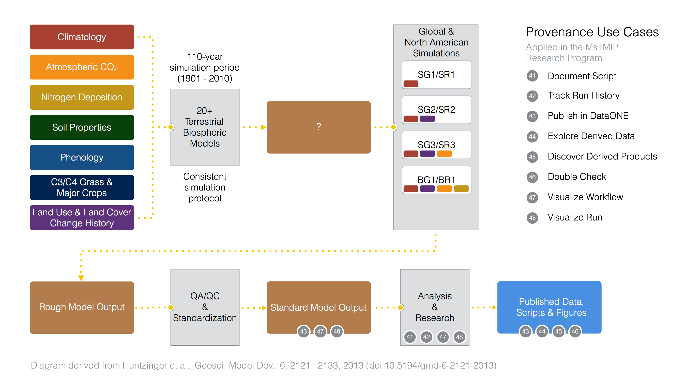

MsTMIP and DataONE: A Science Workflow Scenario for Tracking Provenance
=======================================================================

Improving scientific model sharing and communication through provenance
-----------------------------------------------------------------------

The North American Carbon Program's (NACP) Multiscale Terrestrial Model Intercomparison Project (MsTMIP) is a formal model intercomparison and evaluation effort focused on improving the diagnosis and attribution of carbon exchange at regional and global scales [1].  The MsTMIP effort is being used as a concrete scientific research scenario to evaluate tools being developed within the `DataONE`_ program to track and share scientific workflows and the products that are derived from them or other scientific efforts.

[Add more here. This paragraph will describe the overall steps in the MsTMIP workflow where we are applying the provenance use cases, starting from model driver data ingestion to the published figures, etc. Reference the overview image ...]

   
   Figure 1. An overview of the MsTMIP scientific workflow, labeled with the DataONE use cases being developed to test new provenance tracking software tools.

Step 1: Preparing Driver Data
---------------------------

The MsTMIP core leadership team, with inputs from participating modeling teams, compiled and processed, and standaridzed a set of input data that different terrestrial biosphere models use as drivers to run simulations. This set of driver input data include climatology, atmospheric CO2, nitrogen deposition, soil properties, phenology, C3/C4 grass fractions and major crops distribution, and land use & land cover change history. Each category of these driver input data was prepared in two spatial scales: global half-degree and North American quarter-degree. The MsTMIP core leadership team also prepared a set of observation-based benchmark data sets that would be used for later model validation purpose.

As researchers who prepare model driver data for MsTMIP using Matlab, we want to keep track of our data input files, data output files and scripts so we can review and compare our runs using different Carbon3/Carbon4 (C3C4) calculation algorithms. The Matlab ingestion script takes 3 data sets as inputs:

- global 1/2-degree resolution land cover map
- monthly mean surface air temperature between 2000 and 2010
- monthly mean precipitation between 2000 and 2010

It will then calculate relative fractions of C3 and C4 grass in each 1/2-degree grid cell, and output the result as 3 netCDF files containingi C3 grass relative fraction, C4 grass relative fraction, and overall grass fraction.

Expected Inputs and Outputs
~~~~~~~~~~~~~~~~~~~~~~~~~~~

- Input script is MSTMIP-INPUT-SCRIPT-NAME
    - `C3_C4_map_present.m`_

.. _`C3_C4_map_present.m`: https://github.com/DataONEorg/sem-prov-design/blob/master/docs/use-cases/provenance/example-files/mstmip/Driver/C3C4/C3_C4_map_present.m)

- `Input datasets`_ are MSTMIP-INPUT-DATASET-LIST
    - global 1/2-degree resolution land cover map
    - monthly mean surface air temperature between 2000 and 2010
    - monthly mean precipitation between 2000 and 2010. 

.. _`Input datasets`: https://github.com/DataONEorg/sem-prov-design/tree/master/docs/use-cases/provenance/example-files/mstmip/Driver/C3C4/inputs)

- Input derived datasets are MSTMIP-INPUT-DERIVED-DATASET-LIST
    - Not applicable in this case
    
- Input execution environment attributes are MSTMIP-INPUT-EXECUTION-ENVIRONMENT-ATTRIBUTE-LIST
    - Not applicable in this case

- `Output datasets`_ are MSTMIP-OUTPUT-DATASET-LIST
    - global 1/2-degree C3 grass relative fraction
    - global 1/2-degree C4 grass relative fraction
    - global 1/2-degree grass fraction
.. _`Output datasets`: https://github.com/DataONEorg/sem-prov-design/tree/master/docs/use-cases/provenance/example-files/mstmip/Driver/C3C4/outputs)

- Output recorded script execution is MSTMIP-OUTPUT-RECORDED-SCRIPT-EXECUTION-LIST
    - The list provided by DataONE

- Output provenance relationship list is MSTMIP-PROVENANCE-RELATIONSHIP-LIST 
    - The list provided by DataONE

- Output provenance relationship visualization is MSTMIP-PROVENANCE-RELATIONSHIP-VISUALIZATION
    - The visualization provided by DataONE

- Usability: 
    - Scientist can filter MSTMIP-OUTPUT-RECORDED-SCRIPT-EXECUTION-LIST by execution date, time, input dataset, input derived dataset, output dataset, ...
    - Scientist can view relationships between items in MSTMIP-PROVENANCE-RELATIONSHIP-LIST
    - Scientist can select desired MsTMIP data products and send them to DataONE

Step 2: Instrumenting and running global/North American simulations with terrestrial biospheric models
---------------------------------------------------------------

20+ modeling teams take the standardized model driver data set and conduct various simulation scenarios defined by the MsTMIP, including reference simulation (RG1/RR1), sensitivity simulations (SG1/SR1, SG2/SR2, and SG3/SR3), and baseline simulation (BG1/BR1).

Step 3: QA/QC and standardization of model output
-------------------------------------------------

Modeling teams submit their model results to the MsTMIP central data repository. The MsTMIP core leadership team then perform quality check, harmonization, and standardization to convert outputs from all different models into a consistent and standard format.

Step 4: Analysis and model run intercomparisons
-----------------------------------------------

Researchers in the MsTMIP community access standardized model outputs and benchmark data sets from the MsTMIP central data repository, perform additional data processing as needed, analyze and compare data, and create figures and/or plots to be used in their scientific manuscripts.

References
----------

[1] Huntzinger, et al.: The North American Carbon Program Multi-Scale Synthesis and Terrestrial Model Intercomparison Project – Part 1: Overview and experimental design, Geosci. Model Dev., 6, 2121-2133, doi:10.5194/gmd-6-2121-2013, 2013. `http://dx.doi.org/10.5194/gmd-6-2121-2013`_

.. _`http://dx.doi.org/10.5194/gmd-6-2121-2013`: http://dx.doi.org/10.5194/gmd-6-2121-2013

.. _`DataONE`: http://dataone.org
