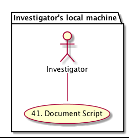

DataONE Use Case 41 (Track Run History)
===================================

Scientists can track, list, and examine script executions
---------------------------------------------------------

Revisions
---------
| Created: 2014-09-23
| Revised: 2014-10-24

Title
----
MsTMIP Driver Provenance Use Case (C3C4)

Goal
----
Scientist working on MsTMIP driver data preparation can track, list and examine script executions

.. sidebar:: Scenario
    
    "As a researcher who prepare model driver data for MsTMIP using Matlab, I want to keep track of my data input files, data output files and scripts so I can review and compare my runs using different C3C4 calculation algorithms. My Matlab script takes 3 data sets as inputs: North American 1/4-degree resolution land cover map, monthly mean surface air temperature between 2000 and 2010, and monthly mean precipitation between 2000 and 2010. It will then calculate relative fractions of C3 and C4 grass in each 1/4-degree grid cell."

Summary
-------
The researcher specifies a Matlab script for which provenance information will be collected. 

The Matlab script is then executed and the input datasets, derived datasets (not applicable in this case) and execution environment attributes (not applicable in this case) that are to be tracked are automatically determined and the provenance relationships between these objects is persisted on the local machine. Data products such as analysis output from the Matlab script, graphical output, etc., that are created by an execution are copied to a local archive.

The scientist can then list recorded script executions, possibly filtering the list by attributes such as execution date and time.
From this list individual executions can be selected for detailed review, such as viewing the provenance relationships between items and inspecting each data product produced by the execution.

The scientist can then select an execution that has produced the desired data producs, and send them to DataONE as detailed in use case #45 (Publish to DataONE).

Inputs/Ouputs
-------
* Input script is *MSTMIP-INPUT-SCRIPT-NAME (_C3_C4_map_present.m)*
* Input datasets are *MSTMIP-INPUT-DATASET-LIST (North American 1/4-degree resolution land cover map, monthly mean surface air temperature between 2000 and 2010, and monthly mean precipitation between 2000 and 2010)*
* Input derived datasets are *MSTMIP-INPUT-DERIVED-DATASET-LIST (Not applicable in this case)*
* Input execution environment attributes are *MSTMIP-INPUT-EXECUTION-ENVIRONMENT-ATTRIBUTE-LIST (Not applicable in this case)*
* Output recorded script execution is *MSTMIP-OUTPUT-RECORDED-SCRIPT-EXECUTION-LIST (the list provided by DataONE)*
* Output provenance relationship list is *MSTMIP-PROVENANCE-RELATIONSHIP-LIST (the list provided by DataONE)*
* Output provenance relationship visualization is *MSTMIP-PROVENANCE-RELATIONSHIP-VISUALIZATION (the visualization provided by DataONE)*
* Usability: scientist can filter *MSTMIP-OUTPUT-RECORDED-SCRIPT-EXECUTION-LIST by execution date, time, input dataset, input derived dataset, output dataset, ...*
* Usability: scientist can view relationships between items in *MSTMIP-PROVENANCE-RELATIONSHIP-LIST*
* Usability: scientist can select desired MsTMIP data products and send them to DataONE 

Use case diagram
-------

.. 
    @startuml images/use-case-41.png
        package "Investigator's local machine" {
        actor "Investigator" as client
        usecase "41. Track Run History" as record
        client -- record
        }
    @enduml

Sequence diagram
-------

.. image:: images/sequence-41.png

.. 
    @startuml images/sequence-41.png
        !include ../plantuml.conf
        title: Run Manager record()
        actor scientist
        == Record ==
        scientist -> "run manager" : record(scriptName)
        "run manager" -> "data package" : init()
        "data package" --> "run manager" : packageId
        note right of "run manager"
        scientist's script read() is
        overloaded by run manager
        end note
        "run manager" -> "run manager" : read()
        "run manager" -> "data package" : insertRelationship()
        note right of "run manager"
        scientist's script write() is
        overloaded by run manager
        end note
        "run manager" -> "run manager" : write()
        "run manager" -> "data package" : insertRelationship()
        "run manager" -> "run manager" : close()
        "run manager" -> "data package" : archive(packageId)
        "data package" -> "provenance store" : save()
        "provenance store" --> "run manager" : status
        == Review ==
        scientist -> "run manager" : list(search terms)
        "run manager" -> "provenance store" : list(search terms)
        "provenance store" --> scientist : package list
        note right of "scientist"
        scientist selects a packge 
        to view from the list
        end note
        scientist -> "run manager" : view(packageId)
        "run manager" -> "provenance store" : view(packageId)
        "provenance store" --> scientist : complete package description
    @endumld

Actors
------
* Investigator
* Client Software

The following diagram shows a script execution on a client machine where a single dataset is read
and the associated provenance 
relationship between the script and the input dataset is captured. This dataset is 
then used to create a derived dataset, then the provenance relationship between the script and derived dataset is recorded.

Preconditions
-------------
* The necessary DataONE run manager packages have been installed
  
Triggers
--------
* Scientist invokes the run manager record() function, providing their script name
* Scientist invokes the run manager list() function, providing search terms to select matching executions
* Scientist invokes the run manager view() function, providing a package identifier

Post Conditions
---------------
* The scientist has created one or more derived datasets.
* The DataONE run manager has stored provenance information locally for the newly created derived datasets.
* The DataONE run manager has archived derived datasets locally so they will not be overwritten by subsequent runs

.. _C3_C4_map_present.m: https://github.com/DataONEorg/sem-prov-design/blob/master/docs/use-cases/provenance/example-files/mstmip/Driver/C3C4/C3_C4_map_present.m
