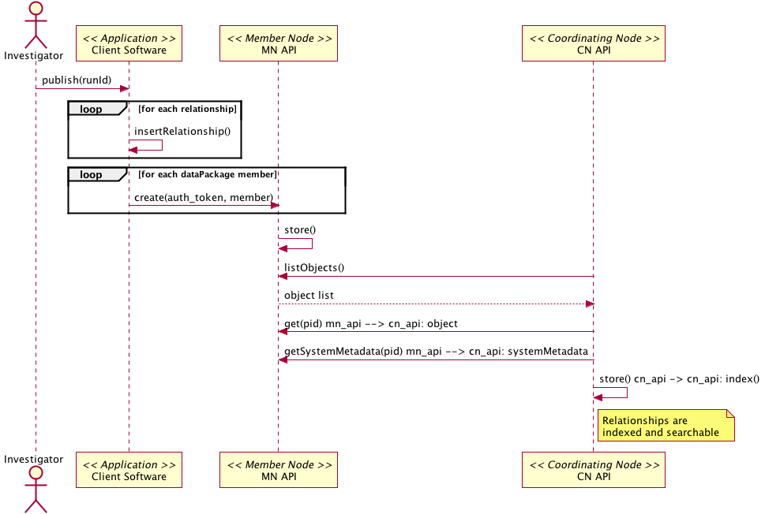

===================
DataONE Use Case 41
===================

------------------------------------------------------------------
Scientists can provide tracking information about derived products
------------------------------------------------------------------

Revisions
---------
2014-09-22-01

Goal
----
In DataONE-enabled client software, investigators can easily provide tracking information as they create new products from existing data files.

Summary
-------
Investigators can upload derived datasets to a Member Node and provide traceable links to the primary resources used to create them. Within scientific analysis environments (particularly R and Matlab), scientists can choose which input datasets to track in their workflow scripts, and can manage the product outputs of each run.

.. 
    @startuml images/41_uc.png       
      actor "Investigator" as client 
      usecase "41. Record/Review" as record
      client -- record    
      usecase "12. Authentication" as authen 
      note top of authen 
        Authentication may be provided by an external service 
      end note    
      package "DataONE" { 
        actor "Coordinating Node" as CN 
        actor "Member Node" as MN 
        usecase "13. Authorization" as author 
        usecase "04. Create" as create 
        usecase "41. Publish" as publish
        usecase "06. MN Synchronize" as mn_sync 
        client -- publish
        CN -- publish
        MN -- publish 
        publish ..> author: <includes> 
        publish ..> authen: <includes> 
        publish ..> mn_sync: <includes> 
        publish ..> create: <includes>
      }       
    @enduml

.. image:: images/41_uc.png

.. 
    @startuml images/41_seq.png 
        Actor Investigator 
        participant "Client Software" as app_client << Application >> 
        participant "MN API" as mn_api << Member Node >> 
        participant "CN API" as cn_api << Coordinating Node >>
        loop
        Investigator -> app_client: record(scriptName)
        app_client --> Investigator: runId
        Investigator -> app_client: view(runId)
        alt derived products are ready to publish
        Investigator -> app_client: publish(runId)
        app_client -> app_client: insertRelationship()
        app_client -> mn_api: create(auth_token, dataPackage) 
        note right of app_client 
        Create request is sent 
        for each data object 
        end note
        mn_api -> mn_api: store()
        cn_api -> mn_api: listObjects()
        mn_api --> cn_api: object list
        cn_api -> mn_api: get(pid) mn_api --> cn_api: object
        cn_api -> mn_api: getSystemMetadata(pid) mn_api --> cn_api: systemMetadata
        cn_api -> cn_api: store() cn_api -> cn_api: index() 
        note right of cn_api 
        Relationships are 
        indexed and searchable 
        end note
        else derived products not ready to publish
        note right of Investigator
        At this point, the Investigator 
        may decide to modify their script 
        and perform the ecord() and view() 
        process again.
        end note
        end
        end    
    @enduml
   

Actors
------
* Investigator
* Client software
* Member Node
* Coordinating Node

Preconditions
-------------
* The primary resource dataset needs to be registered on the Member Node.
* The Investigator needs write access to a Member Node.
* The client software must be DataONE-enabled and provenance-aware.

Postconditions
--------------
* The derived datasets are stored on the Member Node
* The data package includes formal links between the primary and derived datasets

Notes
-----

Use Case Implementation Examples
--------------------------------

* An R Client example of Use Case 41 (Scientists can provide tracking information about derived products):

(… create DataONE data objects and a DataONE data package…)

insertRelationship(data.package, id.result, c(id.script), "http://www.w3.org/ns/prov", "http://www.w3.org/ns/prov#wasGeneratedBy")

insertRelationship(data.package, id.script, c(id.data), "http://www.w3.org/ns/prov", "http://www.w3.org/ns/prov#used")

insertRelationship(data.package, id.data, c(id.data2, id.data3), "http://www.w3.org/ns/prov", "http://www.w3.org/ns/prov#wasDerivedFrom")

createDataPackage(d1client, data.package)

