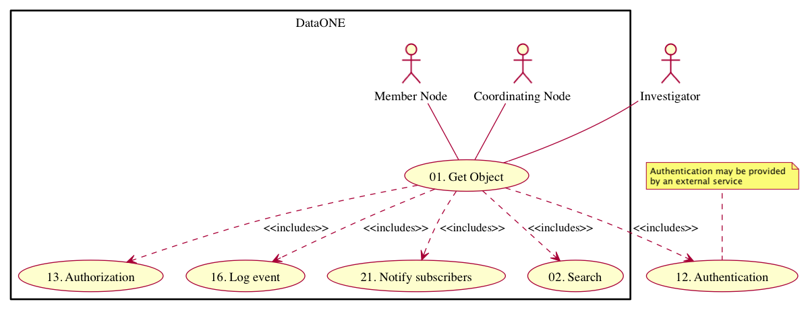
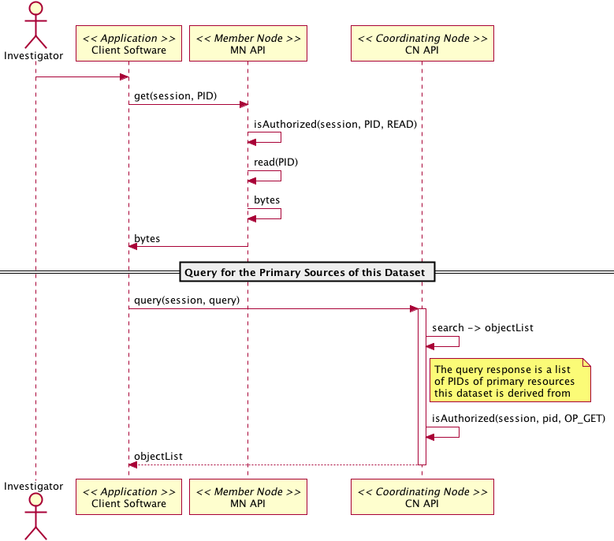

===================
DataONE Use Case 42
===================

---------------------------------------------------------------------------------------------------------
Scientists can examine original dataset(s) that were used to create a synthetic dataset found in DataONE.
---------------------------------------------------------------------------------------------------------

Revisions
---------
2014-09-22-01

Goal
----
Scientists examining a derived dataset in DataONE are able to determine which dataset(s) from DataONE Member Nodes were used in the derivation and can examine those source datasets.

Summary
-------
A scientist that has searched for data relevant to their studies has found a synthetic dataset in DataONE.  They are able to view the relationships between the original and derived datasets, and can download the originals for examination.

.. 
    @startuml images/42_uc.png
        actor "Investigator" as client
        usecase "12. Authentication" as authen
        note top of authen
           Authentication may be provided 
           by an external service
           end note
        package "DataONE"{
        actor "Coordinating Node" as CN
        actor "Member Node" as MN
        usecase "13. Authorization" as author
        usecase "01. Get Object" as get
        usecase "16. Log event" as log
        usecase "21. Notify subscribers" as subscribe
        usecase "02. Search" as query
        client -- get
        CN -- get
        MN -- get
        get ..> author: <<includes>>
        get ..> authen: <<includes>>
        get ..> log: <<includes>>
        get ..> subscribe: <<includes>>
        get ..> query: <<includes>>
        }
    @enduml

.. 
@startuml images/42_seq.png
    Actor Investigator
    participant "Client Software" as app_client << Application >>
    participant "MN API" as mn_api << Member Node >>
    participant "CN API" as cn_api << Coordinating Node >>   
    Investigator -> app_client   
    app_client -> mn_api: get(session, PID)
    mn_api -> mn_api: isAuthorized(session, PID, READ)
      mn_api -> mn_api: read(PID)
      mn_api <- mn_api: bytes
      app_client <- mn_api: bytes     
      == Query for the Primary Sources of this Dataset ==        
      app_client -> cn_api: query(session, query)
      activate cn_api
        cn_api -> cn_api: search -> objectList
        note right of cn_api
          The query response is a list 
          of PIDs of primary resources 
          this dataset is derived from
        end note
        cn_api -> cn_api: isAuthorized(session, pid, OP_GET)
        app_client <-- cn_api: objectList
      deactivate cn_api
@enduml

Actors
------
* Investigator
* Client software
* Member Node
* Coordinating Node

Preconditions
-------------
* The scientist who uploaded the synthetic dataset to a Member Node provided provenance information.
* The client software and user interface must be DataONE-enabled and provenance-aware.
* The synthetic and primary dataset(s) have been indexed by the DataONE Coordinating Nodes
* The synthetic and primary dataset(s) need to be accessible to that authenticated user or the public.

Postconditions
--------------
* The scientist can understand the provenance links and can download the primary and derived datasets.

Notes
-----
User interface mockups of Use Cases 42, 43, and 44 are in PDF format here: 
Science Metadata view: https://github.com/DataONEorg/sem-prov-design/blob/master/docs/use-cases/images/metadata_view_with_use_cases.pdf?raw=true

Data search view: https://github.com/DataONEorg/sem-prov-design/blob/master/docs/use-cases/images/data_search_with_use_case.pdf?raw=true