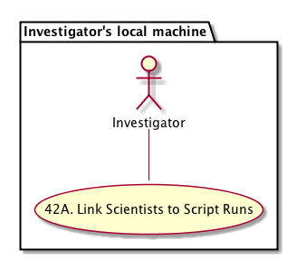
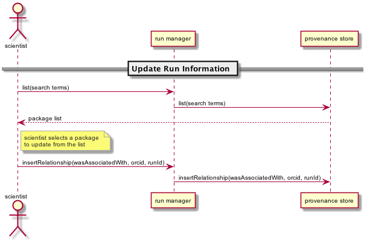

DataONE Use Case 42B (Link Scientists to Script Runs)
=====================================================

Scientists can link their identity to specific runs of scripts
--------------------------------------------------------------

Revisions
---------
| Created: 2014-11-22

Goal
----
Scientist can associate their online identity for particular executions of a script or model.

.. sidebar:: Scenario
    
    "As a scientist using R or Matlab, I want to associate myself to a given script run so I can document that I used the script to derive my published data, figures, or tables."

Summary
-------
In R or Matlab, after executing a script and recording provenance information about the run, a scientist can later update the execution's provenance information by providing a link to a permanent identifier (such as a ORCID) of their online identity.  

*Use case diagram*

.. 
    @startuml images/use-case-42B.png
        package "Investigator's local machine" {
        actor "Investigator" as client
        usecase "42A. Link Scientists to Script Runs" as record
        client -- record
        }
    @enduml

*Sequence diagram*

.. 
    @startuml images/sequence-42B.png
        !include ../plantuml.conf
        actor scientist
        == Update Run Information ==
        scientist -> "run manager" : list(search terms)
        "run manager" -> "provenance store" : list(search terms)
        "provenance store" --> scientist : package list
        note right of "scientist"
        scientist selects a package 
        to update from the list
        end note
        scientist -> "run manager" : insertRelationship(wasAssociatedWith, orcid, runId)
        "run manager" -> "provenance store": insertRelationship(wasAssociatedWith, orcid, runId)
    @endumld

Actors
------
* Investigator
* Client Software

Preconditions
-------------
* The necessary DataONE run manager packages have been installed in R or Matlab
  
Triggers
--------
* Scientist invokes the run manager list() function, providing search terms to select matching executions
* Scientist invokes the run manager insertRelationship() function, providing the relationship type, user identity reference, and execution id

Post Conditions
---------------
* The scientist has updated the execution's provenance information
