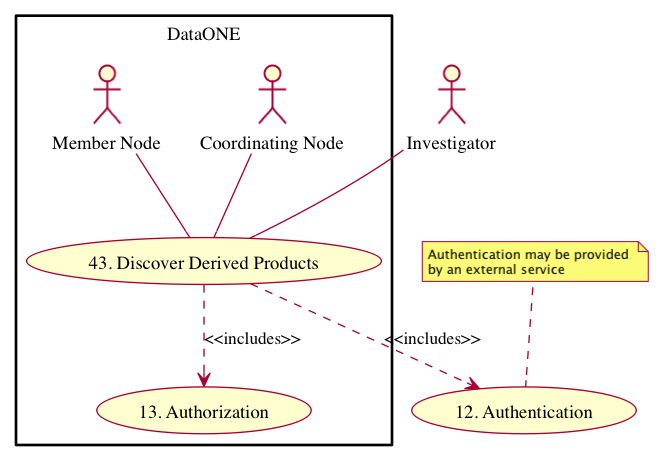

===================
DataONE Use Case 43
===================

----------------------------------------------------------------------------------
Scientists can discover synthetic research that uses their dataset within DataONE.
----------------------------------------------------------------------------------

Revisions
---------
2014-09-22-01

Goal
----
To provide a traceable link to derived works for each dataset.

Summary
-------
A scientist that has uploaded their dataset to DataONE and has allowed derived works in their intellectual rights statement can view and understand which derived works have used their dataset.

.. 
    @startuml images/use-case-43.png
        actor "Investigator" as client
        usecase "12. Authentication" as authn
        note top of authn
          Authentication may be provided 
          by an external service
        end note
        package "DataONE"
          actor "Coordinating Node" as CN
          actor "Member Node" as MN
          usecase "13. Authorization" as authz
          usecase "43. Discover Derived Products" as discover
          client -- discover
          CN -- discover
          MN -- discover
          discover ..> authz: <<includes>>
          discover ..> authn: <<includes>>
    @enduml

.. 
    @startuml images/sequence-43.png
        !include plantuml.conf
         actor Investigator
         participant "Client Software" as app_client << Application >>
         participant "MN API" as mn_api << Member Node >>
         participant "CN API" as cn_api << Coordinating Node >>
         == Retreive primary dataset ==    
         Investigator -> app_client   
         app_client -> mn_api: get(session, PID)
         activate mn_api #D74F57
           mn_api -> mn_api: isAuthorized(session, PID, READ)
           mn_api -> mn_api: read(session,PID)
           mn_api <- mn_api: bytes
         deactivate mn_api
         app_client <-- mn_api: bytes   
         == Search derivations based on primary dataset ==      
         app_client -> cn_api: query(session, query)
         note right of app_client
          Query for any derived datasets
         end note
         activate cn_api #D74F57
           cn_api -> cn_api: prov_search() -> objectList
           note right of cn_api
             The query response is a list 
             of PIDs of primary resources 
             this dataset is derived from
           end note
           cn_api -> cn_api: isAuthorized(session, pid, OP_GET)
           app_client <-- cn_api: objectList
         deactivate cn_api
           app_client -> app_client: render()
    @enduml
    

Actors
------
* Investigator
* Client software
* Member Node
* Coordinating Node

Preconditions
-------------
* The client software and user interface must be DataONE-enabled and provenance-aware.
* The synthetic and primary dataset(s) have been indexed by the DataONE Coordinating Nodes.
* The scientist who uploaded the synthetic dataset to a Member Node provided provenance information.
* The intellectual rights of the primary dataset allows for derived works.

Postconditions
--------------
* DataONE users can examine a list of derived works of each dataset.

Notes
-----
Notes
-----
User interface mockups of Use Cases 42, 43, and 44 are in PDF format here: 
Science Metadata view: https://github.com/DataONEorg/sem-prov-design/blob/master/docs/use-cases/images/metadata_view_with_use_cases.pdf?raw=true

Data search view: https://github.com/DataONEorg/sem-prov-design/blob/master/docs/use-cases/images/data_search_with_use_case.pdf?raw=true
