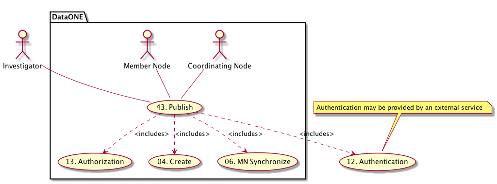

DataONE Use Case 43 (Publish to DataONE)
========================================

Scientists can publish derived datasets and tracking information to DataONE
---------------------------------------------------------------------------

Revisions
---------
| Created: 2014-09-29
| Revised: 2014-10-14

Goal
----
In DataONE-enabled client software, investigators can easily publish new products from existing data files and provide tracking information.

.. sidebar:: Scenario
    
    "As a data analyst using R or Matlab, I want to publish my data and their history so I can share them with colleagues through an established DataONE repository."

Summary
-------
In both R and Matlab, investigators can upload derived datasets to a DataONE Member Node repository.  They can assign citable identifiers to  their dataset (e.g., a DOI), and provide traceable links to the primary datasets used to create them.  

*Use Case Diagram*

.. 
    @startuml images/43_uc.png       
        actor "Investigator" as client 
        usecase "12. Authentication" as authen 
        note top of authen 
          Authentication may be provided by an external service 
        end note    
        package "DataONE" { 
          actor "Coordinating Node" as CN 
          actor "Member Node" as MN 
          usecase "13. Authorization" as author 
          usecase "04. Create" as create 
          usecase "43. Publish" as publish
          usecase "06. MN Synchronize" as mn_sync 
          client -- publish
          CN -- publish
          MN -- publish 
          publish ..> author: <includes> 
          publish ..> authen: <includes> 
          publish ..> mn_sync: <includes> 
          publish ..> create: <includes>
        }       
    @enduml

*Sequence diagram*

.. 
    @startuml images/43_seq.png 
        !include ../plantuml.conf
        Actor Investigator 
        participant "Client Software" as app_client << Application >> 
        participant "MN API" as mn_api << Member Node >> 
        participant "CN API" as cn_api << Coordinating Node >>
        Investigator -> app_client: publish(runId)
        loop for each relationship
            app_client -> app_client: insertRelationship()
        end
        loop for each dataPackage member
            app_client -> mn_api: create(auth_token, member) 
        end
        mn_api -> mn_api: store()
        cn_api -> mn_api: listObjects()
        mn_api --> cn_api: object list
        cn_api -> mn_api: get(pid) mn_api --> cn_api: object
        cn_api -> mn_api: getSystemMetadata(pid) mn_api --> cn_api: systemMetadata
        cn_api -> cn_api: store() cn_api -> cn_api: index() 
        note right of cn_api 
            Relationships are 
            indexed and searchable 
        end note
    @enduml
   

Actors
------
* Investigator
* Client software
* Member Node
* Coordinating Node

Preconditions
-------------
* The primary resource dataset needs to be registered on the Member Node.
* The Investigator needs write access to a Member Node.
* The client software must be DataONE-enabled and provenance-aware.
* The client software has been configured appropriately 

Postconditions
--------------
* The derived datasets are stored on the Member Node
* The data package includes formal links between the primary and derived datasets

Notes
-----

Use Case Implementation Examples
--------------------------------