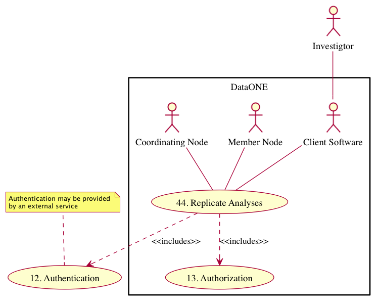

DataONE Use Case 44
===================

Scientists reviewing data tables or figures generated by a script can examine the script using the same input data.
-------------------------------------------------------------------------------------------------------------------

Revisions
---------
2014-09-22-01

Goal
----
To assist reproducible science by providing a link between script or models, the input data used, and the generated output.

Scenario
--------
"As a scientist reviewing derived tables or figures, I want to be able to examine the original datasets and the original script used to generate them so I can understand their history and composition."

Summary
-------
A scientist reviewing a data table or figure in DataONE can discover the script or model that was used to generate it. The scientist can subsequently download and rerun the script to reproduce the same results as the original run.

.. 
    @startuml images/use-case-44.png
        actor "Investigtor" as scientist
        usecase "12. Authentication" as authn
        note top of authn
          Authentication may be provided 
          by an external service
        end note
        package "DataONE"
            actor "Client Software" as client
            actor "Member Node" as mn
            actor "Coordinating Node" as cn
            usecase "44. Replicate Analyses" as rerun
            usecase "13. Authorization" as authz
        scientist -- client
        client -- rerun
        mn -- rerun
        cn -- rerun
        rerun ..> authz: <<includes>>
        rerun ..> authn: <<includes>>   
    @enduml

.. 
    @startuml images/sequence-44.png
        !include plantuml.conf
         actor Investigator
         participant "Client Software" as app_client << Application >>
         participant "MN API" as mn_api << Member Node >>
         participant "CN API" as cn_api << Coordinating Node >>
         == Retreive primary dataset ==    
         Investigator -> app_client   
         app_client -> mn_api: get(session, PID)
         activate mn_api #D74F57
           mn_api -> mn_api: isAuthorized(session, PID, READ)
           mn_api -> mn_api: read(session,PID)
           mn_api <- mn_api: bytes
         deactivate mn_api
         app_client <-- mn_api: bytes   
         == Retreive associated model/script ==      
         app_client -> mn_api: get(session, PID)
         activate mn_api #D74F57
           mn_api -> mn_api: isAuthorized(session, PID, READ)
           mn_api -> mn_api: read(session,PID)
           mn_api <- mn_api: bytes
         deactivate mn_api
         app_client <-- mn_api: bytes
    @enduml

Actors
------
* Investigator
* Client software
* Member Node
* Coordinating Node

Preconditions
-------------
* The client software and user interface must be DataONE-enabled and provenance-aware.
* The dataset has been indexed by the DataONE Coordinating Nodes.
* The data package includes a model or script and its product.
* The data package has a provenance link to the input data.
* The scientist must have access to the same version of scientific analysis software that was used to generate the table or figures. 
* The input parameters to the model or script need to be provided in order to produce the same output.

Postconditions
--------------
* A scientist can review a script or model for quality.
* A scientist can rerun the script to reproduce the same results.

Notes
-----
User interface mockups of Use Cases 42, 43, and 44 are in PDF format here: 
Science Metadata view: https://github.com/DataONEorg/sem-prov-design/blob/master/docs/use-cases/images/metadata_view_with_use_cases.pdf?raw=true

Data search view: https://github.com/DataONEorg/sem-prov-design/blob/master/docs/use-cases/images/data_search_with_use_case.pdf?raw=true

