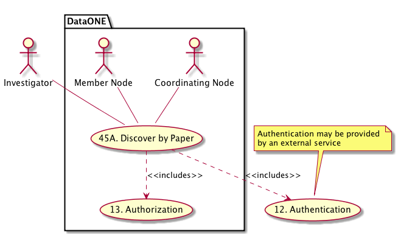
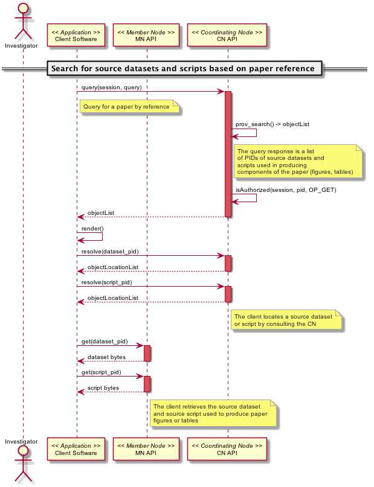

DataONE Use Case 45A (Discover by Paper)
========================================

Scientists can find the data and scripts used to produce the outputs for a given research paper.
------------------------------------------------------------------------------------------------

Revisions
---------
| Created: 2014-11-22

Goal
----
To provide traceable links to source datasets and scripts from a given research paper.

.. sidebar:: Scenario
    
    "As a scientist reviewing a particular paper, I want to be able to view the datasets and scripts used to produce the paper's figures and tables so I can understand how they were created."

Summary
-------
A scientist that has uploaded their datasets and scripts to DataONE has also provided a permanent link to scholarly papers that use the datasets and scripts to produce figures and tables.  A colleague that wants to understand the production of the figures and tables from the data will be able to follow the links to obtain the datasets and scripts used in producing the paper.

*Use Case Diagram*

.. 
    @startuml images/use-case-45A.png
        actor "Investigator" as client
        usecase "12. Authentication" as authn
        note top of authn
          Authentication may be provided 
          by an external service
        end note
        package "DataONE" {
          actor "Coordinating Node" as CN
          actor "Member Node" as MN
          usecase "13. Authorization" as authz
          usecase "45A. Discover by Paper" as discover
          client -- discover
          CN -- discover
          MN -- discover
          discover ..> authz: <<includes>>
          discover ..> authn: <<includes>>
        }
    @enduml

*Sequence diagram*

.. 
    @startuml images/sequence-45A.png
        !include ../plantuml.conf
         actor Investigator
         participant "Client Software" as app_client << Application >>
         participant "MN API" as mn_api << Member Node >>
         participant "CN API" as cn_api << Coordinating Node >>
        == Search for source datasets and scripts based on paper reference ==      
         app_client -> cn_api: query(session, query)
         note right of app_client
          Query for a paper by reference
         end note
         activate cn_api #D74F57
           cn_api -> cn_api: prov_search() -> objectList
           note right of cn_api
             The query response is a list 
             of PIDs of source datasets and
             scripts used in producing 
             components of the paper (figures, tables)
           end note
           cn_api -> cn_api: isAuthorized(session, pid, OP_GET)
           app_client <-- cn_api: objectList
         deactivate cn_api
         app_client -> app_client: render()
         app_client -> cn_api: resolve(dataset_pid)
         activate cn_api #D74F57
         cn_api --> app_client: objectLocationList
         deactivate cn_api
         app_client -> cn_api: resolve(script_pid)
         activate cn_api #D74F57
         cn_api --> app_client: objectLocationList
         deactivate cn_api
         note right of cn_api
           The client locates a source dataset
           or script by consulting the CN
         end note
         app_client -> mn_api: get(dataset_pid)
         activate mn_api #D74F57
         mn_api --> app_client: dataset bytes
         deactivate mn_api
         app_client -> mn_api: get(script_pid)
         activate mn_api #D74F57
         mn_api --> app_client: script bytes
         deactivate mn_api
         note right of mn_api
           The client retrieves the source dataset
           and source script used to produce paper
           figures or tables
         end note
    @enduml
    

Actors
------
* Investigator
* Client software
* Member Node
* Coordinating Node

Preconditions
-------------
* The client software and user interface must be DataONE-enabled and provenance-aware.
* The primary dataset(s) and script(s) have been indexed by the DataONE Coordinating Nodes.
* The scientist who uploaded the primary dataset(s) and script(s) to a Member Node provided provenance information.

Postconditions
--------------
* DataONE users can examine a primary works used to produce a scholarly paper.

