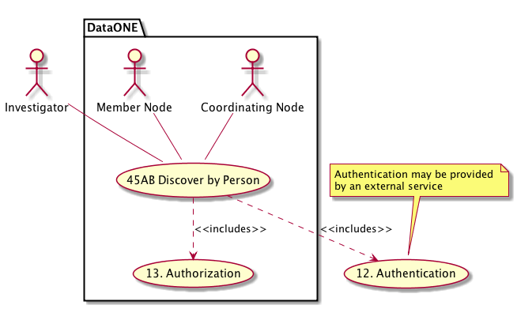
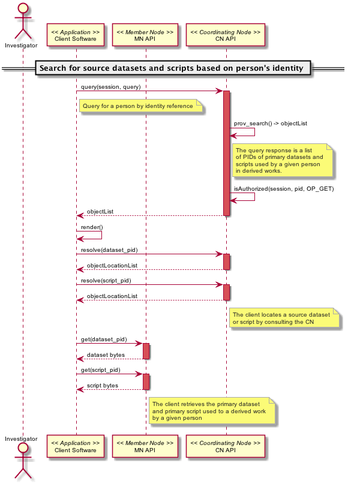

DataONE Use Case 45B (Discover by Person)
========================================

Scientists can find the data and scripts used to by a given person
------------------------------------------------------------------

Revisions
---------
| Created: 2014-11-22

Goal
----
To provide traceable links to source datasets and scripts used by a scientist in a derived work.

.. sidebar:: Scenario
    
    "As a scientist reviewing a person's derived work, I want to be able to view the datasets and scripts used by the person to produce the derived work so I can understand how it was created."

Summary
-------
A scientist that has uploaded their scripts and primary or derived datasets to DataONE has also provided a permanent link to their online identity.  A colleague that wants to understand the work by the original scientist can retrieve the primary datasets and scripts based on the original scientist's identity and a reference to the derived work.

*Use Case Diagram*

.. 
    @startuml images/use-case-45B.png
        actor "Investigator" as client
        usecase "12. Authentication" as authn
        note top of authn
          Authentication may be provided 
          by an external service
        end note
        package "DataONE" {
          actor "Coordinating Node" as CN
          actor "Member Node" as MN
          usecase "13. Authorization" as authz
          usecase "45AB Discover by Person" as discover
          client -- discover
          CN -- discover
          MN -- discover
          discover ..> authz: <<includes>>
          discover ..> authn: <<includes>>
        }
    @enduml

*Sequence diagram*

.. 
    @startuml images/sequence-45B.png
        !include ../plantuml.conf
         actor Investigator
         participant "Client Software" as app_client << Application >>
         participant "MN API" as mn_api << Member Node >>
         participant "CN API" as cn_api << Coordinating Node >>
        == Search for source datasets and scripts based on person's identity ==      
         app_client -> cn_api: query(session, query)
         note right of app_client
          Query for a person by identity reference
         end note
         activate cn_api #D74F57
           cn_api -> cn_api: prov_search() -> objectList
           note right of cn_api
             The query response is a list 
             of PIDs of primary datasets and
             scripts used by a given person
             in derived works.
           end note
           cn_api -> cn_api: isAuthorized(session, pid, OP_GET)
           app_client <-- cn_api: objectList
         deactivate cn_api
         app_client -> app_client: render()
         app_client -> cn_api: resolve(dataset_pid)
         activate cn_api #D74F57
         cn_api --> app_client: objectLocationList
         deactivate cn_api
         app_client -> cn_api: resolve(script_pid)
         activate cn_api #D74F57
         cn_api --> app_client: objectLocationList
         deactivate cn_api
         note right of cn_api
           The client locates a source dataset
           or script by consulting the CN
         end note
         app_client -> mn_api: get(dataset_pid)
         activate mn_api #D74F57
         mn_api --> app_client: dataset bytes
         deactivate mn_api
         app_client -> mn_api: get(script_pid)
         activate mn_api #D74F57
         mn_api --> app_client: script bytes
         deactivate mn_api
         note right of mn_api
           The client retrieves the primary dataset
           and primary script used to a derived work
           by a given person
         end note
    @enduml
    

Actors
------
* Investigator
* Client software
* Member Node
* Coordinating Node

Preconditions
-------------
* The client software and user interface must be DataONE-enabled and provenance-aware.
* The primary dataset(s) and script(s) have been indexed by the DataONE Coordinating Nodes.
* The scientist who uploaded the primary dataset(s) and script(s) to a Member Node provided provenance information.

Postconditions
--------------
* DataONE users can examine primary datasets and scripts used to produce a derived work by a given person.

