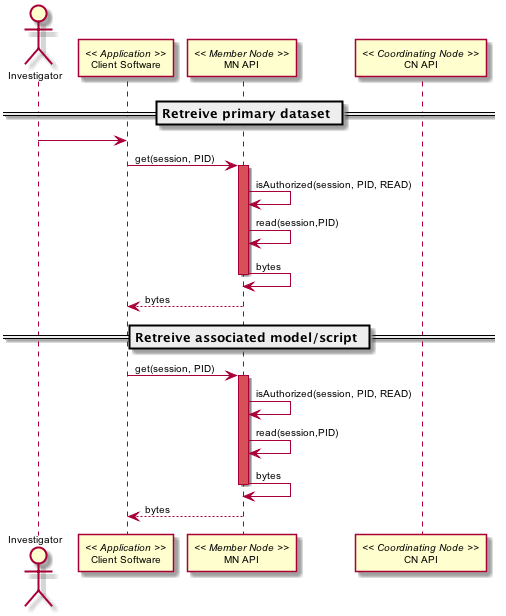

===================
DataONE Use Case 46
===================

---------------------------------------------------------
Scientists can track, list, and examine script executions
---------------------------------------------------------

Revisions
---------
2014-09-23-01

Goal
----
Scientist can track, list and examine script executions

Summary
-------
The user specifies a script (or program, function, etc., as appropriate for their computing environment) for which provenance information will be collected. 
The script is then executed and the input datasets, derived datasets and execution environment attributes that are to be tracked are automatically determined 
and the provenance relationships between these objects is persisted on the local machine. Data products such as analysis output, graphiccal output, etc.,
that are created by an execution are copied to a local archive.

The scientiest can then list recorded script executions, possibly filtering the list by attributes such as execution date and time.
From this list individual executions can be selected for detailed review, such as viewing the provenance relationships between items
and inspecting each data product produced by the execution.

The scientist can then select an execution that has produced the desired data producs, and send them to DataONE 
as detailed in use case #45.

*Use case diagram*

..
  @startuml images/use-case-46.png
  
    package "Investigator's local machine" {
    actor "Investigator" as client
    usecase "46. Record/Review" as record
    client -- record
    }

  @enduml

*Sequence diagram*

..
  @startuml images/sequence-46.png

   title: Run Manager record()
   actor scientist
   == Record ==
   scientist -> "run manager" : record(scriptName)
   "run manager" -> "data package" : init()
   "data package" --> "run manager" : packageId
   note right of "run manager"
   scientist's script read() is
   overloaded by run manager
   end note
   "run manager" -> "run manager" : read()
   "run manager" -> "data package" : insertRelationship()
   note right of "run manager"
   scientist's script write() is
   overloaded by run manager
   end note
   "run manager" -> "run manager" : write()
   "run manager" -> "data package" : insertRelationship()
   "run manager" -> "run manager" : close()
   "run manager" -> "data package" : archive(packageId)
   "data package" -> "provenance store" : save()
   "provenance store" --> "run manager" : status
   == Review ==
   scientist -> "run manager" : list(search terms)
   "run manager" -> "provenance store" : list(search terms)
   "provenance store" --> scientist : package list
   note right of "scientist"
   scientist selects a packge 
   to view from the list
   end note
   scientist -> "run manager" : view(packageId)
   "run manager" -> "provenance store" : view(packageId)
   "provenance store" --> scientist : complete package description

  @endumld

Actors
------
* Investigator
* Client Software

The following diagram shows a script execution on a client machine where a single dataset is read
and the associated provenance 
relationship between the script and the input dataset is captured. This dataset is 
then used to create a derived dataset, then the provenance relationship between the script and derived dataset is recorded.

Preconditions
-------------
* The necessary DataONE run manager packages have been installed
  
Triggers
--------
* Scientist invokes the run manager record() function, providing their script name
* Scientist invokes the run manager list() function, providing search terms to select matching executions
* Scientist invokes the run manager view() function, providing a package identifier

Post Conditions
---------------
* The scientist has created one or more derived datasets.
* The DataONE run manager has stored provenance information locally for the newly created derived datasets.
* The DataONE run manager has archived derived datasets locally so they will not be overwritten by subsequent runs

