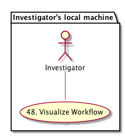
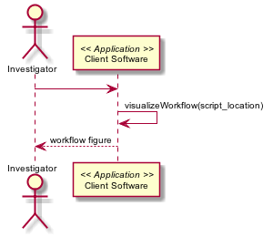

DataONE Use Case 47 (Visualize Workflow)
========================================

Scientists can view a graph of the workflow extracted from scripts with standardized inline comments.
-----------------------------------------------------------------------------------------------------

Revisions
---------
| Created: 2014-10-22
| Revised: 

Goal
----
Scientists can view a simple graph showing the derivation history of their input data and output products for a given analysis script in R or Matlab.

.. sidebar:: Scenario
    
    "As a scientist writing or reviewing an analysis script, I want to be able to view a graph of the components of the script so I can understand the overall workflow."

Summary
-------
A scientist writing or reviewing an analysis script in R or Matlab can run a function that produces a graph as a figure of the high-level workflow represented by the script.  The function will extract the standardized inline comments provided in the script to construct the relationships among script functions, data inputs, and resulting script outputs (like other data tables, figures, etc.).

*Use Case Diagram*

.. 
    @startuml images/use-case-47.png  
        package "Investigator's local machine" {
        actor "Investigator" as client
        usecase "48. Visualize Workflow" as graph
        client -- graph
        }
    @enduml

*Sequence diagram*

.. 
    @startuml images/sequence-47.png
         !include ../plantuml.conf
         actor Investigator
         participant "Client Software" as app_client << Application >>
         Investigator -> app_client   
         app_client -> app_client: visualizeWorkflow(script_location)
         Investigator <-- app_client: workflow figure   
   @enduml

Actors
------
* Investigator
* Client software

Preconditions
-------------
* The client software and user interface must be DataONE-enabled and provenance-aware.
* The script must have comments according to the standardized provenance vocabulary

Postconditions
--------------
* A scientist can view the overall structure and workflow of the components of the script as a simple figure.

Notes
-----
