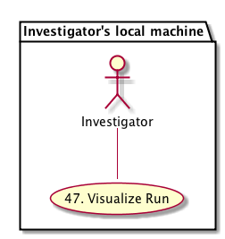
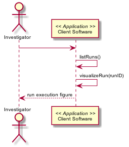

DataONE Use Case 48 (Visualize Run)
========================================

Scientists can view a graph of an executed script, showing processing components, their inputs, and outputs.
------------------------------------------------------------------------------------------------------------

Revisions
---------
| Created: 2014-10-22
| Revised: 

Goal
----
Scientists can view a simple graph showing the derivation history of their input data and output products for a given analysis script in R or Matlab.

.. sidebar:: Scenario
    
    "As a scientist running an analysis script, I want to be able to view a graph of the components of the script that was run so I can understand the overall execution flow, input parameters, and output results."

Summary
-------
A scientist running an analysis script in R or Matlab can run a function that produces a graph as a figure of the high-level workflow result of the execution of the script.  The function will extract standardized inline comments provided in the script to construct the relationships among script functions, data inputs, and resulting script outputs (like other data tables, figures, etc.).

*Use Case Diagram*

.. 
    @startuml images/use-case-48.png  
        package "Investigator's local machine" {
        actor "Investigator" as client
        usecase "47. Visualize Run" as graph
        client -- graph
        }
    @enduml

*Sequence diagram*

.. 
    @startuml images/sequence-48.png
         !include ../plantuml.conf
         actor Investigator
         participant "Client Software" as app_client << Application >>
         Investigator -> app_client   
         app_client -> app_client: listRuns()
         app_client -> app_client: visualizeRun(runID)
         Investigator <-- app_client: run execution figure   
   @enduml

Actors
------
* Investigator
* Client software

Preconditions
-------------
* The client software and user interface must be DataONE-enabled and provenance-aware.
* The script must have comments according to the standardized provenance vocabulary
* The script must have been run once, and provenance information captured for the run

Postconditions
--------------
* A scientist can view the overall flow of the executed script as a simple figure, showing data inputs, outputs, and parameters values used during the run.

Notes
-----
