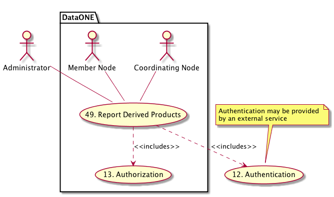

DataONE Use Case 49 (Discover Derived Products)
===============================================

Administrators can view statistics on the creation and use of derived works.
-------------------------------------------------------------------------------

Revisions
---------
| Created: 2014-10-31

Goal
----
To provide a statistical report over time of both the creation and use of derived works within the DataONE network.

.. sidebar:: Scenario
    
    "As an administrator, I want to be able to view summary statistics of the creation and use of all derived products in DataONE so I can understand trends in how data are being shared and reused."

Summary
-------
In order to get an overall view of the effectiveness of data sharing and reuse within the DataONE network, an administrator should be able to view a periodic summary report of both the creation of derived works and the use of derived works.  For instance, on a quarterly basis, how many derived products were created on each Member Node within DataONE? How many scientists are producing derived products on each Member Node? How many scientists are using derived products on each Member Node?  These statistics willl require provenance tracking of source and derived datasets, and indexing of these properties in order to produce a summary report.

*Use Case Diagram*

.. 
    @startuml images/use-case-49.png
        actor "Administrator" as client
        usecase "12. Authentication" as authn
        note top of authn
          Authentication may be provided 
          by an external service
        end note
        package "DataONE" {
          actor "Coordinating Node" as CN
          actor "Member Node" as MN
          usecase "13. Authorization" as authz
          usecase "49. Report Derived Products" as discover
          client -- discover
          MN -- discover
          CN -- discover
          discover ..> authz: <<includes>>
          discover ..> authn: <<includes>>
        }
    @enduml

*Sequence diagram*

Actors
------
* Administrator
* Member Node
* Coordinating Node

Preconditions
-------------
* Derived products must be annotated on the Member Nodes
* Coordinating Nodes must synchronize and index derived products
* The user interface must be able to summarize and display indexed provenance statistics

Postconditions
--------------
* Administrators can examine a report of periodic creation and usage statistics of derived works by Member Node

Notes
-----
