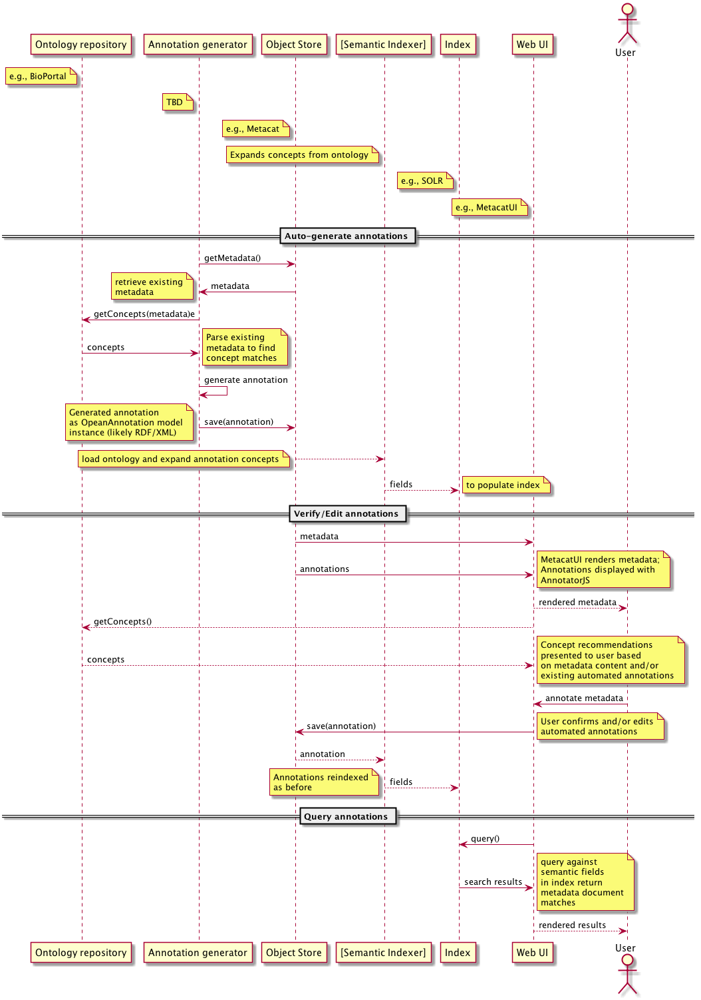

Semantic Architecture proposal
===================================

Author: Ben Leinfelder

Date: October, 2014: Initial draft of semantic architecture 

Goal: Describe components to be used and/or built to support semantic annotation 

Summary:
  
This architecture attempts to re-use as many existing DataONE components as possible while also building on existing efforts in the 
annotation realm
This annotation model uses the OA ontology (http://www.openannotation.org/spec/core/) to describe
the annotation assertions about metadata resources and fragments. PROV, FOAF, DCTERMS, and OBOE concepts are also utilized.
There is ongoing investigation in the Open Knowledge Foundation's annotation tools, including: 
AnnotatorJS (http://annotatorjs.org/) and their AnnotateIt (http://annotateit.org/) storage service. 
  
  
Overview
---------------------------------------
There will be a model for storing and communicating annotations.
There will be a mechanism for storing annotations.
There will be a component for indexing and querying annotations.

Model
------------------
The OA ontology (http://www.openannotation.org/spec/core/) will be used to capture and communicate annotations.
The serialization of this model can take multiple forms and can be included in other objects that may already be indexed by DataONE.
Some examples include:

* Atomic OA documents that contain one or more annotations (sserialized as RDF/XML and/or) JSON-LD
* Extended ORE documents	
* Embedded OA annotations in XML metadata (e.g., EML's additionalMetadata section)

We will initially focus on atomic annotation documents that can be parsed and loaded into a triplestore (which may or may not be persistent)
and that can then be queried to populate a discovery index (e.g., SOLR)

Proposed components
--------------------

.. 
    @startuml images/semantic_architecture.png  
	  participant "Ontology repository" as ontrepo
	  participant "Annotation generator" as autoann
	  participant "Object Store" as store
	  participant "[Triple Store]" as triplestore
	  participant "Index" as index  
	  participant "Web UI" as webui
	  actor "User" as user
	    
	  note left of ontrepo: e.g., BioPortal
	  note left of autoann: TBD
	  note left of store: e.g., Metacat
	  note left of triplestore: e.g., Jena  
	  note left of index: e.g., SOLR
	  note left of webui: e.g., MetacatUI
	
	  == Auto-generate annotations ==
	  
	  autoann -> store: getMetadata()
	  store -> autoann: metadata
	  note left
	  	retrieve existing
	  	metadata
	  end note
	  autoann -> ontrepo: getConcepts(metadata)e
	  ontrepo -> autoann: concepts
	  note right
	  	Parse existing 
	  	metadata to find
	  	concept matches
	  end note
	  autoann -> autoann: generate annotation  
	  autoann -> store: save(annotation)
	  note left
	  	Generated annotation
	  	as OpeanAnnotation model
	  	instance (likely RDF/XML)
	  end note
	  
	  store --> triplestore
	  note left
	  	load OA model into triplestore
	  end note
	  triplestore --> index: fields
	  note right
	  	query triplestore
	  	to populate index
	  end note
	   
	  == Verify/Edit annotations ==
	  
	  store -> webui: metadata
	  store -> webui: annotations
	  note right
	  	MetacatUI renders metadata;
	  	Annotations displayed with
	  	AnnotatorJS
	  end note
	  webui --> user: rendered metadata
	  
	  webui --> ontrepo: getConcepts()
	  ontrepo --> webui: concepts
	  note right
	  	Concept recommendations
	  	presented to user based 
	  	on metadata content and/or
	  	existing automated annotations
	  end note
	  user -> webui: annotate metadata
	  webui -> store: save(annotation)
	  note right
	  	User confirms and/or edits
	  	automated annotations
	  end note
	  
	  store --> triplestore: annotation
	  triplestore --> index: fields
	  note left
	  	Annotations reindexed 
	  	as before
	  end note
	  
	  == Query annotations ==
	  
	  webui -> index: query()
	  index -> webui: search results
	  note right
	  	query against
	  	semantic fields 
	  	in index return 
	  	metadata document
	  	matches
	  end note
	  webui --> user: rendered results
	  
	@enduml

