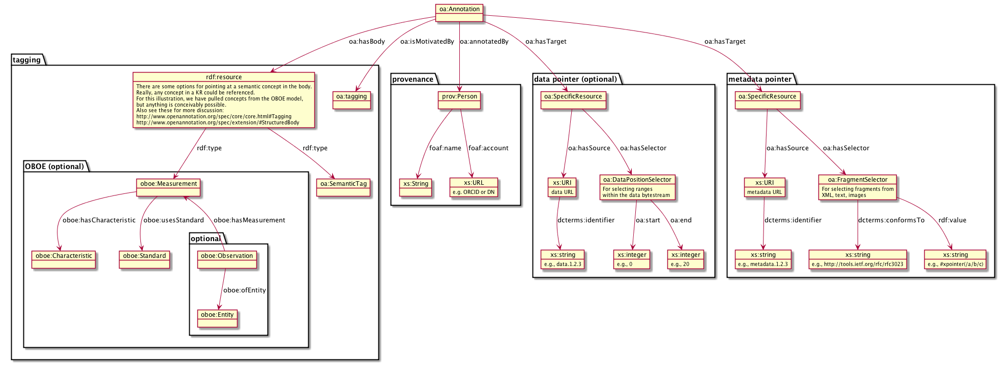

Semantic Architecture proposal
===================================

Author: Ben Leinfelder

Date: October, 2014: Initial draft of semantic architecture 

Goal: Describe components to be used and/or built to support semantic annotation 

Summary:
  
This architecture attempts to re-use as many existing DataONE components as possible while also building on existing efforts in the 
annotation realm
This annotation model uses the OA ontology (http://www.openannotation.org/spec/core/) to describe
the annotation assertions about metadata resources and fragments. PROV, FOAF, DCTERMS, and OBOE concepts are also utilized.
There is ongoing investigation in the Open Knowledge Foundation's annotation tools, including: 
AnnotatorJS (http://annotatorjs.org/) and their AnnotateIt (http://annotateit.org/) storage service. 
  
  
Overview
---------------------------------------
There will be a model for storing and communicating annotations.
There will be a mechanism for storing annotations.
There will be a component for indexing and querying annotations.

Model
------------------
The OA ontology (http://www.openannotation.org/spec/core/) will be used to capture and communicate annotations.
The serialization of this model can take multiple forms and can be included in other objects that may already be indexed by DataONE.
Some examples include:

* Atomic OA documents that contain one or more annotations (sserialized as RDF/XML and/or) JSON-LD
* Extended ORE documents	
* Embedded OA annotations in XML metadata (e.g., EML's additionalMetadata section)

We will initially focus on atomic annotation documents that can be parsed and loaded into a triplestore (which may or may not be persistent)
and that can then be queried to populate a discovery index (e.g., SOLR)

Notes:

The model proposal follows the OA specification as interpreted for our DataONE uses. 
Please review the section where the 'oa:hasBody' property is used to associate an OBOE concept as there are many possible
ways to reference OBOE concepts depending on the KR we use to define measurements, characteristics and standards.
Also, take note of how we are targeting the METADATA object using an xpointer to a specific part of the document (XML).
We have not endeavored to annotate DATA objects directly (e.g., tabular text/csv). In order to accommodate that, 
'oa:hasSource' would reference a data URI and the selector would be some alternative 'oa:Selector' subclass.

.. 
    @startuml images/oa_model.png  
    
    object "oa:Annotation" as annotation
    

    package "tagging" {
    
    	object "oa:tagging" as motivation
    	object "oa:SemanticTag" as semanticTag
	   	object "rdf:resource" as body {
	   		There are some options for pointing at a semantic concept in the body.
	   		Really, any concept in a KR could be referenced.
	   		#Measurement
	   		#Characteristic
	   		#Standard
			Also see these for more discussion:
	   		http://www.openannotation.org/spec/core/core.html#Tagging 
	   		http://www.openannotation.org/spec/extension/#StructuredBody
		}
	    
	    package OBOE {
		    
		    object "oboe:Measurement" as measurement		    
		   	object "oboe:Characteristic" as characteristic
	    	object "oboe:Standard" as standard
	    	
	    	package optional {
			    object "oboe:Observation" as observation
			    object "oboe:Entity" as entity
			} 
		}

	}
	
	package "metadata option" {
	    object "oa:SpecificResource" as target
	    object "xs:URI" as source {
	    	metadata URL
	    }
	    object "xs:string" as identifier {
	    	e.g., metadata.1.2.3
	    }
	    object "oa:FragmentSelector" as selector {
	    	For selecting fragments from
	    	XML, text, images
	    }
	    object "xs:string" as selectorValue {
	    	e.g., #xpointer(/a/b/c)
	    }
	    object "xs:string" as syntax {
	    	e.g., http://tools.ietf.org/rfc/rfc3023
	    }
	}
	
	package "data option" {
	    object "oa:SpecificResource" as d_target
	    object "xs:URI" as d_source {
	    	data URL
	    }
	    object "xs:string" as d_identifier {
	    	e.g., data.1.2.3
	    }
	    object "oa:DataPositionSelector" as d_selector {
	    	For selecting ranges 
	    	within the data bytestream
	    }
	    object "xs:integer" as d_start {
	    	e.g., 0
	    }
	    object "xs:integer" as d_end {
	    	e.g., 20
	    }
	}
    
    package provenance {
	    object "prov:Person" as person
	    object "xs:String" as string
	    object "xs:URL" as url {
	    	e.g. ORCID or DN
	    }
	}  
    
    'setup annotation
    annotation --> body: "oa:hasBody"
    annotation --> motivation: "oa:isMotivatedBy"
    
    'provenance
    annotation --> person: "oa:annotatedBy"
    person --> string : "foaf:name"
    person --> url : "foaf:account"
    
    'the body of the annotation
    body --> measurement: "rdf:type"
    body --> semanticTag: "rdf:type"
    
    measurement --> characteristic: "oboe:hasCharacteristic"
    measurement --> standard: "oboe:usesStandard"
   	measurement <-- observation: "oboe:hasMeasurement"
   	observation --> entity: "oboe:ofEntity"
    
    'data target
    annotation --> d_target: "oa:hasTarget"
    d_target --> d_source: "oa:hasSource"
    d_source --> d_identifier: "dcterms:identifier"
    d_target --> d_selector: "oa:hasSelector"
    d_selector --> d_start: "oa:start"
    d_selector --> d_end: "oa:end"
    
    'metadata target
    annotation --> target: "oa:hasTarget"
    target --> source: "oa:hasSource"
    source --> identifier: "dcterms:identifier"
    target --> selector: "oa:hasSelector"
    selector --> syntax: "dcterms:conformsTo"
    selector --> selectorValue: "rdf:value"
    
    'relationship between the two
    'source -> d_source: "cito:documents"    
    
    @enduml

Proposed components
--------------------

.. image:: images/semantic_architecture.png

.. 
    @startuml images/semantic_architecture.png  
	  participant "Ontology repository" as ontrepo
	  participant "Annotation generator" as autoann
	  participant "Object Store" as store
	  participant "[Triple Store]" as triplestore
	  participant "Index" as index  
	  participant "Web UI" as webui
	  actor "User" as user
	    
	  note left of ontrepo: e.g., BioPortal
	  note left of autoann: TBD
	  note left of store: e.g., Metacat
	  note left of triplestore: e.g., Jena  
	  note left of index: e.g., SOLR
	  note left of webui: e.g., MetacatUI
	
	  == Auto-generate annotations ==
	  
	  autoann -> store: getMetadata()
	  store -> autoann: metadata
	  note left
	  	retrieve existing
	  	metadata
	  end note
	  autoann -> ontrepo: getConcepts(metadata)e
	  ontrepo -> autoann: concepts
	  note right
	  	Parse existing 
	  	metadata to find
	  	concept matches
	  end note
	  autoann -> autoann: generate annotation  
	  autoann -> store: save(annotation)
	  note left
	  	Generated annotation
	  	as OpeanAnnotation model
	  	instance (likely RDF/XML)
	  end note
	  
	  store --> triplestore
	  note left
	  	load OA model into triplestore
	  end note
	  triplestore --> index: fields
	  note right
	  	query triplestore
	  	to populate index
	  end note
	   
	  == Verify/Edit annotations ==
	  
	  store -> webui: metadata
	  store -> webui: annotations
	  note right
	  	MetacatUI renders metadata;
	  	Annotations displayed with
	  	AnnotatorJS
	  end note
	  webui --> user: rendered metadata
	  
	  webui --> ontrepo: getConcepts()
	  ontrepo --> webui: concepts
	  note right
	  	Concept recommendations
	  	presented to user based 
	  	on metadata content and/or
	  	existing automated annotations
	  end note
	  user -> webui: annotate metadata
	  webui -> store: save(annotation)
	  note right
	  	User confirms and/or edits
	  	automated annotations
	  end note
	  
	  store --> triplestore: annotation
	  triplestore --> index: fields
	  note left
	  	Annotations reindexed 
	  	as before
	  end note
	  
	  == Query annotations ==
	  
	  webui -> index: query()
	  index -> webui: search results
	  note right
	  	query against
	  	semantic fields 
	  	in index return 
	  	metadata document
	  	matches
	  end note
	  webui --> user: rendered results
	  
	@enduml
	
	
Annotation life-cycle
---------------------
This figure attempts to show the route that annotations take throughout
the system. First, automated annotations are generated from existing metadata,
then the annotation is saved to the object store, then an indexing process loads the 
Open Annotation model in a triplestore to use a semantic query to extract index fields
from it that are saved to the SOLR index.
Finally, the UI shows the search results and annotation details for further manual editing 
of the annotations.

.. 
    @startuml images/annotation_flow.png
				
		partition "Automated annotation" {
			"get metadata" --> "generate OA model"
			"get matching concepts" --> "generate OA model"
			-left-> [object store] "store annotation"
		}
		
		partition Indexing {
			--> "load OA model"
			--> "triple store"
			--> "SPARQL query model"
			--> "index semantic fields"
			--> "SOLR index"
			
		}
		
		partition "Manual annotation" {
			
			"render annotations" -> "metadata UI"
			"render metadata" --> "metadata UI"
			"metadata UI" -up-> "create/update annotation"
			-right-> [object store] "store annotation"
			
		}
		
		partition "Querying" {
			"query UI" --> "query SOLR index"
			--> "SOLR index"
			--> "render results"
			if "" then
				--> [match?]"show details"
				--> "metadata UI"
			else 
				--> "query UI"	
			endif

			

		}
	@enduml		

Annotation components
----------------------
This diagram attempts to illustrate the different components involved in 
automatically generating annotations, saving them, indexing them, querying them, 
displaying them, and then editing them manually.

.. image:: images/annotation_components.png

.. 
    @startuml images/annotation_components.png
		
		"Annotation generator" --> [getConcepts] "Ontology repository"
		
		"Ontology repository" --> [concepts] "Annotation generator"
		note left
			Recommends concepts 
			using existing attribute 
			metadata
		end note
		"Annotation generator" -->[Save OA] "Store"
		note right
			Use coordinating node
			as the annotation store.
			Also holds metadata documents
		end note
		
		"Web UI" --> [Save OA] "Store"
		"Store" --> [Rendered OA] "Web UI"			
		"Store" --> [Rendered Metadata] "Web UI"
		note left
			UI renders metadata
			and overlays annotations
			on the page
		end note
		note right
			UI creates and 
			edits annotations
			using suggestions 
			from ontology repo
		end note
		
		"Web UI" --> [getConcepts] "Ontology repository"
		"Ontology repository" --> [concepts] "Web UI"
		
		
		"Store" --> [Get OA] "Indexer"
		note right
			When annotations are updated,
			indexer reloads and queries 
			the model for indexing
		end note
		"Indexer" -->[Load OA] "Triple store"
		note right
			Optionally expose
			triple store for 
			other clients to query
		end note
		"Indexer" --> [SPARQL query] "Triple store"	
		"Triple store" --> [SPARQL results] "Indexer"
		"Indexer"-->[SOLR fields] "SOLR index"
		note left
			Existing SOLR index
			includes semantic fields
			for quick searching
		end note
		"Web UI" --> [SOLR query] "SOLR index"
		"SOLR index" --> [SOLR results] "Web UI"
	
		

	@enduml	

