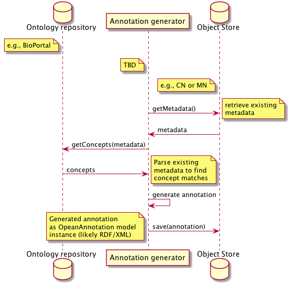

DataONE Use Case 50 (Automatic Annotation)
==========================================

Measurement Characteristics and Standards can be assigned automatically using existing metadata
------------------------------------------------------------------------------------------------

Revisions
---------
2014-10-07: Created
2014-10-13: Updated to reflect discussion at weekly meeting

Goal
----
Using existing attribute-level metadata (column names, labels, definitions, units), a utility can automatically generate semantic annotations
for the data objects.

Scenario
--------
Given the large corpus of existing/historical metadata within the DataONE network, we want to quickly categorize the measurement characteristics and standards
used by data packages uploaded to DataONE repositories. Tying these measurements to clearly defined concepts in one or more ontologies will allow us to 
provide more precise query results while also expanding our query criteria to include subclasses of annotation concepts.

Summary
-------
Using natural language to do a "first pass" at assigning semantic annotations will help organize our holdings and [hopefully] provide better search recall.
This can be done on existing "legacy" content as well as on any new incoming data packages. Perhaps at the discretion of the MN that contributes the objects.

Initially, we will target a focused set of data packages in order to evaluate the efficacy of adding automated annotations. Probably SBC-LTER primary production data.
This is intended more as an internal validation step and not so much the end-game for automatic annotation. Ideally, we will automate annotations for all content,
assuming we have appropriate ontologies from which to select concepts.

Sequence Diagram
----------------
.. 
    @startuml images/uc_50_seq.png 
		participant "Ontology repository" as ontrepo
		participant "Annotation generator" as autoann
		participant "Object Store" as store 
		
		note left of ontrepo: e.g., BioPortal
		note left of autoann: TBD
		note left of store: e.g., CN or MN
			  
	  autoann -> store: getMetadata()
	  note right
	  	retrieve existing
	  	metadata
	  end note
	  store -> autoann: metadata
	  
	  autoann -> ontrepo: getConcepts(metadata)
	  ontrepo -> autoann: concepts
	  note right
	  	Parse existing 
	  	metadata to find
	  	concept matches
	  end note
	  autoann -> autoann: generate annotation  
	  autoann -> store: save(annotation)
	  note left
	  	Generated annotation
	  	as OpeanAnnotation model
	  	instance (likely RDF/XML)
	  end note
    @enduml
   

Actors
------
* Annotation generator
* Ontology repository
* Member Node/Coordinating Node

Preconditions
-------------
* Datapackages with attribute-level metadata need to be registered in DataONE network.
	* Either as raw metadata (requires annotator to parse various metadata formats)
	* Attribute metadata as exposed in the existing DataONE SOLR index. If done as-is, we loose the structural source of the attribute information
	(first data table, third column).
* The annotation generator must have read-access to the metadata. 
	* public documents, of course
	* private documents, as well (run the annotator as admin role that has access to all content).
* The annotation generator must have write access to the CN/MN store.

Postconditions
--------------
* The generated annotations are stored on the Coordinating Node.
* The annotations are marked as being created by the automatic process.
* The annotations share the same permissions as the metadata upon which they are based (editable by the original document owner).

Notes
-----

Use Case Implementation Examples
--------------------------------

