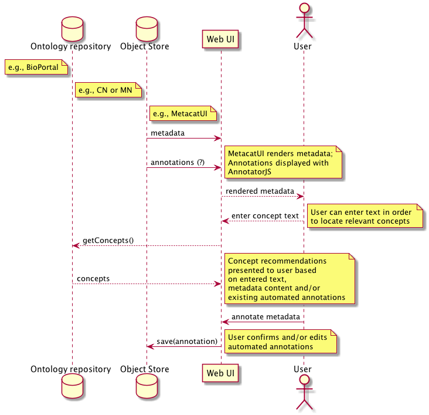

DataONE Use Case 51 (Manual Annotation)
==========================================

User edits or adds annotations to DataONE-hosted data packages
--------------------------------------------------------------

Revisions
---------
2014-10-07: Created

Goal
----
Using a web UI, a user can add or edit annotations about the measurement characteristics and standards used in a data package.

Scenario
--------
When viewing metadata for existing data packages, a user can select concepts from one [or more?] ontologies that describe the measurement 
characteristics (e.g., Temperature) and standards (e.g., Celsius) used. These concepts are the body of the annotations.

Summary
-------
The user may wish to confirm or refute the automatically generated annotations (see UC 50). This is similar to authoring annotations
from scratch, but will hopefully be easier since we can constrain the list of possible concepts using recommendations from the ontology repository
given values from our existing metadata descriptions of the attributes.

Sequence Diagram
----------------
.. 
    @startuml images/uc_51_seq.png 
		participant "Ontology repository" as ontrepo
		participant "Object Store" as store 
		participant "Web UI" as webui
	  	actor "User" as user
		
		note left of ontrepo: e.g., BioPortal
		note left of store: e.g., CN or MN
	  	note left of webui: e.g., MetacatUI
		
			  
	  store -> webui: metadata
	  store -> webui: annotations
	  note right
	  	MetacatUI renders metadata;
	  	Annotations displayed with
	  	AnnotatorJS
	  end note
	  webui --> user: rendered metadata
	  
	  webui --> ontrepo: getConcepts()
	  ontrepo --> webui: concepts
	  note right
	  	Concept recommendations
	  	presented to user based 
	  	on metadata content and/or
	  	existing automated annotations
	  end note
	  user -> webui: annotate metadata
	  webui -> store: save(annotation)
	  note right
	  	User confirms and/or edits
	  	automated annotations
	  end note
    @enduml
   

Actors
------
* Annotation library
* Ontology repository
* Member Node/Coordinating Node
* web UI for rendering metadata + annotations

Preconditions
-------------
* Datapackages with attribute-level metadata needs to be registered in DataONE network
* The user must have read-access to the metadata
* The user must have write access to the object in order to approve or remove recommended annotations
* The user must have write access to the CN/MN to save annotations

Postconditions
--------------
* The new/updated annotations are stored on the Coordinating Node.
* The annotations are marked as being updated and verified by the user as applicable
* Existing annotations share the same permissions as the metadata upon which they are based.
* New annotations have all permission for the creator, read-only access for everyone else. Other options TBD.

Notes
-----

Use Case Implementation Examples
--------------------------------

