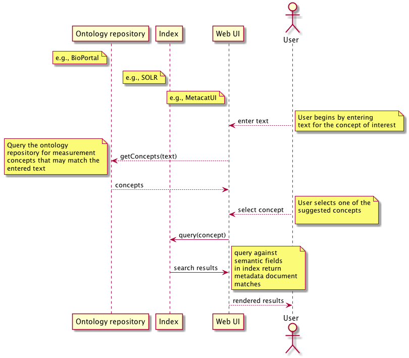

DataONE Use Case 52 (Semantic search)
==========================================

Searches for DataONE-hosted data packages that match semantic measurement concepts
----------------------------------------------------------------------------------

Revisions
---------
2014-10-07: Created
2014-10-13: Updated to reflect discussion at weekly meeting
2014-11-21: added a section called "Background" which describes the LTER primary production data discovery problem
2015-04-29: Started adding specific SOLR queries for testing

Goal
----
Query for datapackages using semantic measurement concepts about characteristics and standards.

Scenario
--------
In addition to querying for datapackages using keywords and coverage information, users will be able to query 
datapackages that include measurement annotations matching desired concepts for Characteristics and Standards.

Five Science Scenarios are included here to illustrate how scientist use data:

A. Coastal marine primary production: A scientist wants to know total annual net ecosystem primary production in a  coastal marine environment in southern California. This will entail discovering and processing (e.g., summing) the areal production rates for several groups of primary  producers, e.g., a) phytoplankton, b) benthic turf algae, c) seagrass  beds, d) kelp. Individual measurements required different methods due to differences in organism size and growth rate. Some measurements may be reported for  an entire community (phytoplankton, algal turf). Some may be  species-specific (kelp, seagrass, turf). The scientist expects to  discover measurements in a variety of time scales (daily to annual), and  spatial dimensions (volumetric or areal); possibly but less likely, different spatial scales (most scaled to meter).

Possible queries the KR will need to address: Q4, Q9
 

B. Processes contributing to NEE in a forest: Terrestrial carbon budgets are generally constructed either by a) measuring specific sizes and changes in pools over time, b) directly measuring fluxes, or c) modeling. A scientist wants to compare the results of different methods of constructing carbon budgets in a forest, and so will need access to many different measurements, eg. mass of foliar, woody, root, litter and soil carbon, accumulation rates (for the same pools), autotoropthic, heterotrophic respiration rates, eddy  covariance (NEE) (e.g., from Table 1,  http://www.geos.ed.ac.uk/home/homes/mwilliam/Williams05a.pdf)

Possible queries the KR will need to address: Q1, Q2

D. Annual above-ground NPP in a grassland during droughts [NOTE: this scenario was adapted from the MsTMiP scenario in use case 42, but is now for a data-discovery point of view. ]
A scientist is studying drought recovery in grasslands. He wants to compare  the MsTMIP model output to other "benchmark" data sets, so needs data  from the MsTMIP central data repository, plus other data relating above-ground NPP to precipitation rates in grasslands. He will perform  additional data processing.

Possible queries the KR will need to address: Q1, Q3, Q6, Q7, Q8

D. Compare biomes: A scientist has a study to compare primary production rates across several biomes studied in the LTER, eg, temperate forests, grasslands, nearshore ocean and salt marshes.  

Possible queries the KR will need to address: Q1, Q3, Q6, Q7, Q8

Lastly, this scenario would necessitate a KR extension. A likely extension would be to add terms related to ocean acidification and carbonate chemistry. Like research in primary production, the study of ocean acidification also addresses the effects of anthropogenic CO2. The form of CO2 found in natural water bodies is bicarbonate ion (HCO3-), and bicarbonate is consumed by phytoplankton during photosynthesis. 

E. Ocean acidification and carbonate chemistry: The ocean has absorbed one-third to half the atmospheric CO2 produced by human fossil fuel combustion. Dissolved CO2 in the ocean becomes carbonic acid, driving the pH down and causing large shifts in seawater carbonate  chemistry speciation. A scientist wants to understand possible changes to calcium carbonate saturation states, which impact shell-forming marine  organisms (e.g., molluscs, echinoderms and corals). For this, she needs to find environmental observations on pH, alkalinity, and carbonate-system parameters. The scientists knows that given a minimum set of inputs, a suite of carbonate chemistry parameters can be calculated (concentrations, equilibrium constants, indices).

Possible queries the KR will need to address: Q5, Q10

Summary
-------
Additional query facets will be specified just like keywords, but will support more precise matches as well as 
subclass matching when the query specifies a broader concept. For example, a query for the characteristic concept
of "Mass" would return datapackages that were annoted as either having "WetMass" or "DryMass".

Typically, a user will select a concept from a list of available concepts. These could be displayed in a flat list or
using a tree structure so that relationships between parent and children are easily seen. In prior iterations of these
types of interfaces, it has been useful to show the hierarchical context for concepts and whether or not we have content 
for any one of those concepts shown.

Sequence Diagram
----------------
.. 
    @startuml images/uc_52_seq.png 
                database "Ontology repository" as ontrepo
                  database "Index" as index 
                participant "Web UI" as webui
                  actor "User" as user
                
                note left of ontrepo: e.g., BioPortal
                note left of index: e.g., SOLR
                  note left of webui: e.g., MetacatUI
                
                user --> webui: enter text
                note right
                        User begins by entering
                        text for the concept of interest
                end note
                webui --> ontrepo: getConcepts(text)
                note left
                        Query the ontology
                        repository for measurement
                        concepts that may match the
                        entered text
                end note
                ontrepo --> webui: concepts        
                user --> webui: select concept
                note right
                        User selects one of the
                        suggested concepts

                end note          
                webui -> index: query(concept)
                index -> webui: search results
                note right
                          query against
                          semantic fields 
                          in index return 
                          metadata document
                          matches
                end note
                webui --> user: rendered results
          
    @enduml
   

Actors
------
* Discovery Index
* Ontology repository
* web UI for selecting concepts, issuing query, and displaying results

Preconditions
-------------
* Semantic annotations for the datapackage identifier must be present in the discovery index
* Concepts to search by must be available somewhere (e.g., BioPortal)

Postconditions
--------------
* Query results returned by datapackage identifier, minimally.

Sample Queries
---------------
Sample queries that we can support, in increasing order of complexity.  These will be divided into implementation phases.

- Queries using only oboe:Characteristic
    - List datasets with measurements of
    
        - Q1: List datasets with measurements of above ground net primary productivity
            SELECT ?identifier {
                ?agnpp a lter:AboveGroundNetPrimaryProduction
                lter:AboveGroundNetPrimaryProduction a oboe:Characteristic
            }
                PrimaryProduction
                - NetPrimaryProduction
                - GrossPrimaryProduction
            - Attribute 3 of dataset 23 measures GrossPrimaryProduction
            - index characteristic:{ECSO_123456,ECSO_34567} #includes all of the superclasses, none of the subclasses. depends on annotation being at the lowest level possible.
        - query interface: takes natural language input, maps to one or more classes
               - sends those classes in query against index
        - baseline solr query (Natural language):
            - https://cn.dataone.org/cn/v1/query/solr/?fl=identifier,title,author&q=formatType:METADATA+AND+(datasource:*LTER+OR+datasource:*KNB)+AND+-obsoletedBy:*+AND+net+primary+productivity&rows=100&start=0
                - numFound="2101"
            - https://cn.dataone.org/cn/v1/query/solr/?fl=identifier,title,author&q=formatType:METADATA+AND+(datasource:*LTER+OR+datasource:*KNB)+AND+-obsoletedBy:*+AND+abstract:net+primary+productivity&rows=100&start=0
                - numFound="1193"
            - https://cn.dataone.org/cn/v1/query/solr/?fl=identifier,title,author&q=formatType:METADATA+AND+(datasource:*LTER+OR+datasource:*KNB)+AND+-obsoletedBy:*+AND+title:net+primary+productivity&rows=100&start=0
                - numFound="844"
            - https://cn.dataone.org/cn/v1/query/solr/?fl=identifier,title,author&q=formatType:METADATA+AND+(datasource:*LTER+OR+datasource:*KNB)+AND+-obsoletedBy:*+AND+(title:NPP+OR+title:net+primary+productivity+OR+abstract:net+primary+productivity)&rows=100&start=0
                - numFound="844"

        - What solr fields should be in baseline query? (list of choices is here: https://cn.dataone.org/cn/v1/query/solr )
            - the more we include, we get higher recall, lower precision?
            - title, abstract, attribute, keyword
            - methods

        - Ontology search solr query:
            - https://cn.dataone.org/cn/v1/query/solr/?fl=identifier,title,author&q=formatType:METADATA+AND+(datasource:*LTER+OR+datasource:*KNB)+AND+-obsoletedBy:*+AND+characteristic:ECSO_123456&rows=100&start=0

        - Q2: List datasets with measurements of heterotrophic soil respiration at the ecosystem level
            SELECT ?identifier {
                ?heterresp a lter:HeterotrophicSoilRespiration
                lter:HeterotrophicSoilRespiration a oboe:Characteristic
            }
            
        - Q5: List datasets with measurements of concentration of carbonate species in the ocean (C02, bicarbonate, carbonate)
        
- Queries using oboe:Characteristic and oboe:Entity
    - List datasets with measurements of
        
        - Q3: List datasets with measurements of the amount of carbon (grams) in soil microbial communities
            
        - Q4: List datasets with measurements of areal CO2 uptake rate by natural phytoplankton communities  
    
        - Q6: List datasets with measurements of rate of release of carbon dioxide from soil
        
        - Q7: List datasets with measurements of uptake of CO2 in a grassland when CO2 is experimentally added 
        
        - Q8: List datasets with measurements of areal rate of methane released from soil
        
        - Q9: List datasets with measurements of annual rate of net primary production for coastal macroalgae
        
        - Q10: List datasets with measurements of CO2 absorption by the ocean

Notes
-----
The current implementation plan - using the SOLR index for semantic queries - does not allow the user to specify 
[Characteristic AND Standard] for a single attribute. So in datapackages with attributes that match either of those
criteria we will get what loks like an odd result (Characteristic: Height AND Standard: Gram).

Support for querying entity is not planned (e.g., no "Height of a Tree" criteria).

Use Case Implementation Examples
--------------------------------

For Q1:Q10:
1 baselne queries to all metadata
1 baseline query to a subset of metadata (still to decide: what fields) MOB TO DO: find 
1 semantic query (name of field=___)

Target 3 types of queries for each plain-english query:
 - 1) Best SOLR nat lang fields query from UI fields available
  - ONEMercury
  - MetacatUI (search.test.dataone.org)
 - 2) Best SOLR nat lang fields query using any fields
  - pseudo code: (attributeName|attributeLabel|attributeDescription = soil* AND attributeUnits = gram AND abstract|title|methods = hetertroph)
 - 3) Best semantic fields query

Query 1

Query 2

Query 3

Query 4
 - Plain english: List datasets with measurements of areal primary productivity rate by oceanic phytoplankton   
 - best SOLR: (attribute:\"*production\" or attribute:\"productivity\" AND attribute:milligramPerMeterCubedPerDay) AND (abstract:phytoplankton OR title:phytoplankton) AND (abstract:carbon14)
 - metacat UI fields: phytoplankton productivity
 - 1Merc UI fields: TBD
 - best semantic: TBD

Query 5
  - Plain english: List datasets with measurements of concentration of carbonate chemistry species in the ocean 
  - best SOLR: (attribute:\"*carbonate\" or attribute:\"C02\" or attribute:\"carbon dioxide\" AND attribute:micromolePerKilogram) AND (abstract:ocean OR title:ocean) AND (abstract:co2calc OR methods:co2calc)
  - metacat UI fields: carbonate chemistry
  - 1Merc UI fields: TBD
  - best semantic: TBD

Query 6

Query 7

Query 8

Query 9

Query 10

-------------------------------
Query testing: recall and precision
-------------------------------
Files for testing recall and precision can be found at:
https://github.com/DataONEorg/semantic-query

