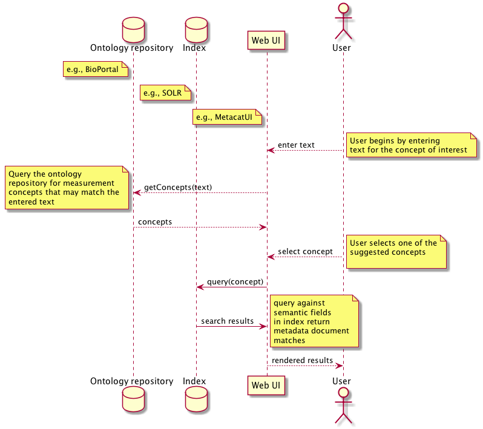

DataONE Use Case 52 (Semantic search)
==========================================

Searches for DataONE-hosted data packages that match semantic measurement concepts
----------------------------------------------------------------------------------

Revisions
---------
2014-10-07: Created
2014-10-13: Updated to reflect discussion at weekly meeting

Goal
----
Query for datapackages using semantic measurement concepts about characteristics and standards.

Scenario
--------
In addition to querying for datapackages using keywords and coverage information, users will be able to query 
datapackages that include measurement annotations matching desired concepts for Characteristics and Standards.

Summary
-------
Additional query facets will be specified just like keywords, but will support more precise matches as well as 
subclass matching when the query specifies a broader concept. For example, a query for the characteristic concept
of "Mass" would return datapackages that were annoted as either having "WetMass" or "DryMass".

Typically, a user will select a concept from a list of available concepts. These could be displayed in a flat list or
using a tree structure so that relationships between parent and children are easily seen. In prior iterations of these
types of interfaces, it has been useful to show the hierarchical context for concepts and whether or not we have content 
for any one of those concepts shown.

Sequence Diagram
----------------
.. 
    @startuml images/uc_52_seq.png 
		database "Ontology repository" as ontrepo
	  	database "Index" as index 
		participant "Web UI" as webui
	  	actor "User" as user
		
		note left of ontrepo: e.g., BioPortal
		note left of index: e.g., SOLR
	  	note left of webui: e.g., MetacatUI
		
		user --> webui: enter text
		note right
			User begins by entering
			text for the concept of interest
		end note
		webui --> ontrepo: getConcepts(text)
		note left
			Query the ontology
			repository for measurement
			concepts that may match the
			entered text
		end note
		ontrepo --> webui: concepts	
		user --> webui: select concept
		note right
			User selects one of the
			suggested concepts

		end note	  
		webui -> index: query(concept)
		index -> webui: search results
		note right
		  	query against
		  	semantic fields 
		  	in index return 
		  	metadata document
		  	matches
		end note
		webui --> user: rendered results
	  
    @enduml
   

Actors
------
* Discovery Index
* Ontology repository
* web UI for selecting concepts, issuing query, and displaying results

Preconditions
-------------
* Semantic annotations for the datapackage identifier must be present in the discovery index
* Concepts to search by must be available somewhere (e.g., BioPortal)

Postconditions
--------------
* Query results returned by datapackage identifier, minimally.

Sample Queries
---------------
TODO: sample semantic queries should be shared here.

* In natural language, the kinds of questions people would like to ask
** Show datasets with data on
*** rate of release of carbon dioxide from soil 
*** carbon dioxide experimentally added to a grassland 
*** above ground net primary productivity 
*** heterotrophic soil respiration at the ecosystem level 
*** soil microbe carbon pools 
*** methane release from soil 
*** CO2 uptake by the ocean
*** ocean carbonate chemistry 

Notes
-----
The current implementation plan - using the SOLR index for semantic queries - does not allow the user to specify 
[Characteristic AND Standard] for a single attribute. So in datapackages with attributes that match either of those
criteria we will get what loks like an odd result (Characteristic: Height AND Standard: Gram).

Support for querying entity is not planned (e.g., no "Height of a Tree" criteria).

Use Case Implementation Examples
--------------------------------

