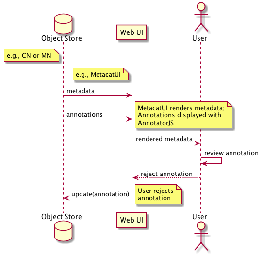

DataONE Use Case 53 (Reject Annotation)
==========================================

Owner rejects an annotation made by other person/process
--------------------------------------------------------------

Revisions
---------
2014-10-08: Created
2014-10-13: Updated to reflect discussion at weekly meeting

Goal
----
Using a web UI, a user can reject annotations that were added either by a 3rd party or an automatic annotation process which are believed to
be erroneous.

Scenario
--------
The owner of a given data package should have the ability to mark automatic annotations incorrect when reviewing the results of
automatic annotations.
Similarly, annotations from colleagues and other parties should be subject to the same review.

Summary
-------
If an owner sees a incorrect annotation, they can mark it (reject it) at which point it should no longer inform query results.

Sequence Diagram
----------------
.. 
    @startuml images/uc_53_seq.png 
		database "Object Store" as store 
		participant "Web UI" as webui
	  	actor "User" as user
		
		note left of store: e.g., CN or MN
	  	note left of webui: e.g., MetacatUI
		
			  
	  store -> webui: metadata
	  store -> webui: annotations
	  note right
	  	MetacatUI renders metadata;
	  	Annotations displayed with
	  	AnnotatorJS
	  end note
	  webui -> user: rendered metadata
	  user -> user: review annotation	  
	  user --> webui: reject annotation
	  webui -> store: update(annotation)
	  note right
	  	User rejects
	  	annotation
	  end note
    @enduml
   

Actors
------
* Annotation library
* Member Node/Coordinating Node
* web UI for rendering metadata + annotations

Preconditions
-------------
* Datapackages with attribute-level metadata need to be registered in DataONE network
* The user must have write access to the object in order to reject recommended/3rd-party annotations
* The user must have write access to the CN/MN to update annotations

Postconditions
--------------
* The updated annotations are stored on the Coordinating Node.
* The annotations are marked as being rejected by the owner as applicable

Notes
-----
This is a simplified approach to our intitial "confirm or refute annotation" plan. Until explicitly marked as incorrect,
all current annotations will be used to populate the search index for discovery. Ultimately, the owner of the original data package
has the final say in what is correct when it comes to annotations in the system.

Use Case Implementation Examples
--------------------------------

