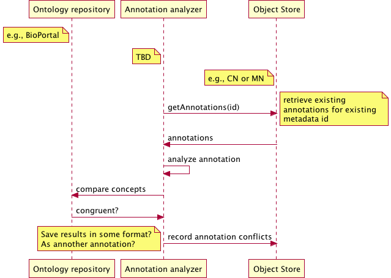

DataONE Use Case 54 (Annotation conflicts)
==========================================

Conflicting annotations are shown to users
-------------------------------------------

Revisions
---------
2014-10-08: Created

Goal
----
Identify conflicting semantic annotations using inferencing.

Scenario
--------
When multiple users or processes are generating annotations about the same objects, conflicting perspectives may arise.
Some conflicts are corrections to erroneous annotations. Others are subtle differences in interpretation. 
We can certainly show the conflicts, but it's unclear how to resolve those that are completely incongruent (who wins?).

Summary
-------

Sequence Diagram
----------------
.. 
    @startuml images/uc_54_seq.png 
	  participant "Ontology repository" as ontrepo
	  participant "Annotation analyzer" as autoann
	  participant "Object Store" as store 
		
	  note left of ontrepo: e.g., BioPortal
	  note left of autoann: TBD
	  note left of store: e.g., CN or MN
			  
	  autoann -> store: getAnnotations(id)
	  note right
	  	retrieve existing
	  	annotations for existing 
	  	metadata id
	  end note
	  store -> autoann: annotations
	  
	  autoann -> autoann: analyze annotation  	  
	  autoann -> ontrepo: compare concepts
	  ontrepo -> autoann: congruent?
	  autoann -> store: record annotation conflicts
	  note left
	  	Save results in some format?
	  	As annother annotation?
	  end note
    @enduml
   

Actors
------
* Annotation analyzer
* Member Node/Coordinating Node
* web UI for rendering metadata + annotation conflicts

Preconditions
-------------
* Datapackages with attribute-level metadata need to be registered in DataONE network
* Annotation analyzer must have read access to annotations and ontologies they reference (for inference)

Postconditions
--------------
* Conflicting annotations are identified (perhaps with another annotation? TBD)

Notes
-----

Use Case Implementation Examples
--------------------------------

