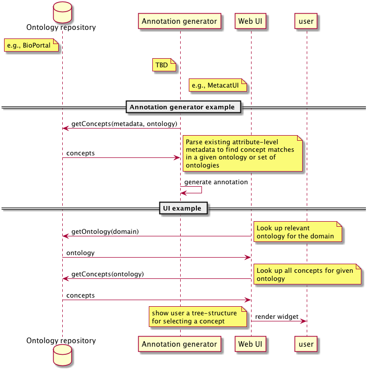

DataONE Use Case 55 (Ontology repository)
==========================================

Need repository for storing and querying ontology concepts
----------------------------------------------------------

Revisions
---------
2014-10-13: Created

Goal
----
DataONE should support or recommend a repository for storing and querying ontology concepts.

Scenario
--------
Many processes and user interfaces will depend on reliably locating relevant ontologies and concepts
within those ontologies. Systems like BioPortal are quite mature and expose an API for querying concepts 
in the repository.

Summary
-------
Typical query operations involving concepts in an ontology are:

* locating applicable ontologies given some free text about a subject (e.g., which ontologies pertain to my domain?)
* locating concepts within one or more different ontologies given some free text (e.g., which concepts best capture this particular variable or attribute?)
* locating concepts within ontologies with a combination of text and other constraints like units of measurement 
(e.g., if we know the unit is "meters per second" then we know the characteristic will be some kind of velocity concept)
* locating subclasses subclasses and parents of given concepts 
(e.g., expanding queries to include child concepts or for building UI widgets that show these relationships)
	

Sequence Diagram
----------------
.. 
    @startuml images/uc_55_seq.png 
		participant "Ontology repository" as ontrepo
		participant "Annotation generator" as autoann
		participant "Web UI" as webui 
		
		note left of ontrepo: e.g., BioPortal
		note left of autoann: TBD
		note left of webui: e.g., MetacatUI
			  
	  == Annotation generator example ==			  
	  autoann -> ontrepo: getConcepts(metadata, ontology)
	  ontrepo -> autoann: concepts
	  note right
	  	Parse existing attribute-level
	  	metadata to find concept matches
	  	in a given ontology or set of
	  	ontologies
	  end note
	  autoann -> autoann: generate annotation  
	  
	  == UI example ==
	  webui -> ontrepo: getOntology(domain)
	  note right
	  	Look up relevant 
	  	ontology for the domain
	  end note
	  ontrepo -> webui: ontology
	  
	  webui -> ontrepo: getConcepts(ontology)
	  note right
	  	Look up all concepts for given
	  	ontology
	  end note
	  ontrepo -> webui: concepts
	  webui -> user: render widget
	  note left
	 	 show user a tree-structure 
	 	 for selecting a concept
	  end note 
	  
    @enduml
   

Actors
------
* Clients (e.g., annotation generator, web UI)
* Ontology repository

Preconditions
-------------
* Domain-relevant ontologies must be well-managed 
* Namespaces and versioning must be reliable and consistent
	
Postconditions
--------------
* The ontologies should be accessible via clear APIs for different clients to consume
* Concept matches should be returned in order or with a weighted score reflecting how
confident a match was made

Notes
-----
There is ongoing discusssion about the efficacy of the BioPortal concept matching algorithm.
Researchers at RPI are advocating an alternative, but it is not yet a 'product' in the way that
BioPortal is available and supported.
TODO: other features that need to be present in the ontology repository?

Use Case Implementation Examples
--------------------------------

